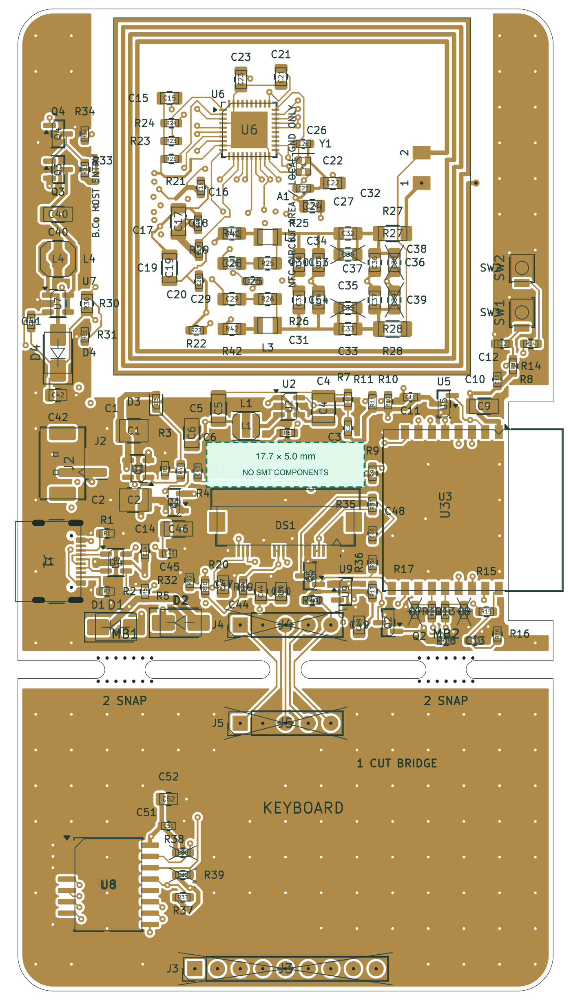

# Nucula Board

An ESP32-C3 hardware prototype with USB-C, battery charging, PN7160 NFC,
an SSD1309 OLED interface, and a detachable I²C keyboard section.

**Status: routed prototype, awaiting physical bring-up.** The current
**routing-review-2026-09-22** package is for five bare boards and manual assembly,
with ordinary unfilled vias and a 17.70 × 5.00 mm display-ribbon access area.
Supplier CAM review, RF tuning, power measurements and display fit checks remain.



## Open the design

Clone this repository and open `nucula-v2.kicad_pro` in **KiCad 10** with its
standard symbol, footprint and 3D libraries installed. Project-specific libraries
use relative paths. The project filenames retain the hardware revision name
`nucula-v2`; the GitHub repository is `nucula-board`.

```sh
git clone https://github.com/zeugmaster/nucula-board.git
cd nucula-board
python3 tools/check_schematic.py
```

The check requires Python 3 and KiCad CLI. See [validation and repository
notes](docs/publication.md) for other checks, dependencies and historical inputs.

## Hardware and documentation

The five-sheet schematic contains the ESP32-C3-WROOM-02-N4, native USB-C data,
a 100 mA single-cell Li-ion charger with JST-PH connector, USB/battery supply
selection, a 3.31 V buck rail, and boot/reset/voltage supervision. It is adapted
from Olimex ESP32-C3-DevKit-Lipo **revision C**. It now includes the PN7160 NFC
controller and antenna matching tree, SSD1309 OLED glass driver/boost supply,
and a detachable PCF8574T keyboard section. The four-layer PCB is placed and
routed, with all components on top and the NFC circuitry inside the coil.

- [Completed PCB layout, layer drawings and validation](docs/pcb-layout.md)
- [Routing repair, before/after comparison and geometry audit](docs/routing-review.md)
- [Standard manufacturing package and order settings](docs/manufacturing-release.md)
- [Complete manufacturing ZIP](manufacturing/routing-review-2026-09-22-package.zip)
- [Circuit simulation screening, findings and model limits](docs/simulation/README.md)
- [Schematic PDF](docs/schematic.pdf)
- [Design choices, datasheets and outstanding hardware limits](docs/power-design.md)
- [NFC, OLED, I²C pin map and breakaway keyboard design](docs/peripherals-design.md)
- [35 mm keyboard breakaway geometry and separation instructions](docs/keyboard-breakaway.md)
- [40 mm NFC coil, calculated matching values and prototype tuning guide](docs/nfc-antenna.md)
- [Selected crystal, capacitor calculations and confirmed prototype interfaces](docs/component-refinements.md)
- [Five-board assembly audit and historical sourcing notes](docs/assembly-readiness.md)
- [Manufacturing simplification and ribbon-clearance changes](docs/standard-fabrication.md)
- [BOM](docs/bom.csv) and [verification results](docs/verification.json)
- [Project library sources and licenses](libraries/README.md)

Battery target: approximately 400 mAh, protected single-cell Li-ion/LiPo,
3.7 V nominal / 4.2 V full; 2-pin JST-PH at 2.0 mm pitch, pin 1 positive,
pin 2 ground. Charging remains 100 mA (0.25C at 400 mAh).
Battery operation is optional for this prototype; runtime/discharge capability
and improved low-battery behavior are deferred. J2 uses a vertical SMT JST-PH
2.00 mm connector, B2B-PH-SM4-TB(LF)(SN), JLCPCB C160352.
The intended USB source is a dedicated **5 V / at least 1.5 A** supply; the
steady-state planning budget is about 1.10 A including charging. Startup/inrush
must be tested; operation from arbitrary computer hosts is not qualified.

Run `python3 tools/check_schematic.py` to repeat ERC, connectivity, pad/model and
voltage checks. KiCad's standard symbols, footprints and 3D models are required;
`KICAD_CLI` and `KICAD_SHARE` can override their locations. The project-specific
parts and the ESP32 STEP model are included with relative paths in `libraries/`.
The optional PN7160 3D model is omitted because its terms prohibit redistribution;
its symbol and electrical footprint are included.
All 128 physical components have assigned footprints. A1 is a reusable four-turn
40 × 40 mm PCB coil with its bottom return and copper keepout included. The NFC
tree now has calculated starting values, 0805 manual tuning pads and TX isolation
links. [A separate bare-coil coupon](prototypes/nfc-antenna/nfc-antenna.kicad_pro)
is available for fabrication and measurement. The OLED now uses the **24-contact
CON24 pinout** in the reference breakout schematic, superseding the earlier
26-contact assumption. DS1 is a Hirose FH12A-24S-0.5SH(55), 0.5 mm top-contact socket (C506794).
[Pinout and regression checks](docs/oled24/README.md) cover all 24 connections.
The target panel has ribbon marking **NFP1309-02Y**: 2.4-inch COG,
0.50 mm pitch, 0.30 mm flex, contacts on the emitting face. In its confirmed
mounted position the tip contacts face away from the PCB. The
[top-contact update and checks](docs/oled24/top-contact.md) cover the new lands,
paste apertures and 0.20 mm placement adjustment. The display and external keypad are excluded
from the assembly BOM; DS1 purchases the socket only.
See the library notes for unavailable models.

The shared I²C bus runs at 100 kHz: PN7160 `0x28`, SSD1309 `0x3C`, PCF8574T `0x20`.
PCF8574T is an eight-bit I/O expander; no bus multiplexer is needed.
Its SOIC-16W_7.5x10.3mm_P1.27mm footprint matches the earlier BOM.
J3 is the user-fitted, DNP nine-pin keyboard header: **pins 1 and 9 are NC;
pins 2–8 connect to P0–P6**, preserving the early board's seven-line order.
[Keypad pinout and scanning notes](docs/keyboard-interface.md).
J4/J5 are optional DNP
five-pin headers for reconnecting the keyboard section after separation.

Y1 is now NDK NX2016SA-27.12MHZ-EXS00A-CS06346 (JLCPCB C3008209),
2.0 × 1.6 mm, with calculated 12 pF / 15 pF load-capacitor starts. Power
capacitor ordering codes and larger bulk footprints are selected using archived
manufacturer DC-bias curves. Run `python3 tools/check_component_choices.py` to
reproduce those estimates. RF tuning, oscillator qualification and power
measurements remain prototype bring-up work. **Placement and routing are complete**
for the agreed USB-powered prototype. Native PCB DRC has zero errors and zero
unconnected items; the layout report records 40 reviewed cosmetic warnings
and the remaining prototype measurements. All six independent routing-quality
checks pass after repairing the free-form routing regression. The 261 scoped
SPICE cases were rerun.

Git tracks design files, project libraries and documentation. Local editor state,
lock files, automatic backups and KiCad's `.history` are ignored.

Manufacturing files now target five bare four-layer boards, nominal 1.6 mm,
green mask, white legend and ENIG using the supplier's standard stackup.
Routing vias are 0.30 mm drill / 0.70 mm land, without filling or capping.
There is no controlled-impedance requirement. The package includes updated
116-part placements, stencil data and assembly drawings. The component BOM
is unchanged. [Manufacturing changes and validation](docs/standard-fabrication.md).

The [JLCPCB r2 archive](manufacturing/jlcpcb-2026-09-21-r2-package.zip) records
the previously submitted board and remains unchanged. Its order settings and
placements belong to that earlier design. Use the new package for new orders.

## License and attribution

The hardware design is distributed under [CERN-OHL-S-2.0](LICENSE), retaining
the attribution and license of the Olimex ESP32-C3-DevKit-Lipo revision C design
from which the power section was adapted. Third-party library assets and
reference documents retain their own terms; see [library attribution](libraries/README.md)
and [LICENSES](LICENSES/). These notices do not grant additional rights to
third-party material. Firmware is not included in this repository.
