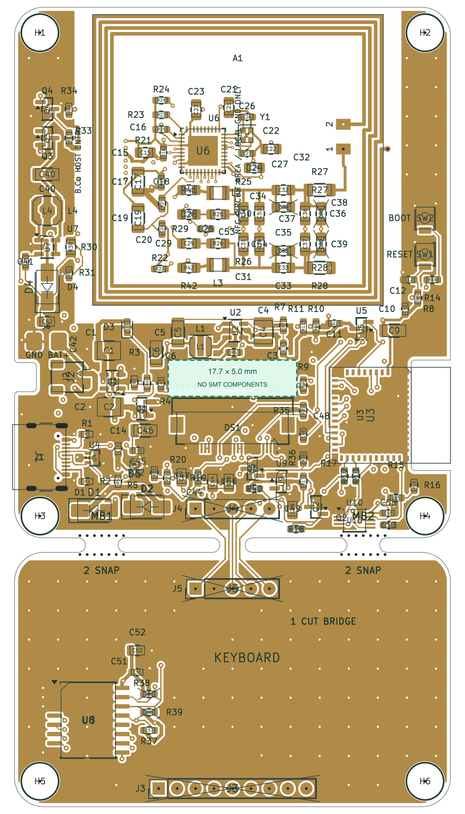

# Nucula Board

An ESP32-C3 hardware prototype with USB-C, battery charging, PN7160 NFC,
an SSD1309 OLED interface, and a detachable I²C keyboard section.

**Status: Rev-A bring-up found a reversed display interface and USB backfeed.**
The editable design now corrects and reroutes all 24 display contacts at the
unchanged socket orientation. The USB redesign replaces the VBUS-steering ESD
array with ground-referenced protection and adds a VBUS-controlled data switch.
It uses the accepted diagnosis from the existing measurements; revised hardware
still needs bench validation. See the [USB fix](docs/bringup/usb-backfeed-fix.md)
and [display correction and measurements](docs/bringup/rev-b-display-and-usb.md).
The [October prototype package](manufacturing/mounting-2026-10-08-package.zip)
includes six M2 mounting holes, the MINI-1 module with a flush antenna cutout, these corrections,
the side-entry battery connector and labeled J6
pads for directly soldered battery leads. Revised
hardware still needs bench validation. September archives are historical.
The ordinary unfilled vias and 17.70 × 5.00 mm ribbon access remain.



## Open the design

Clone this repository and open `nucula-v2.kicad_pro` in **KiCad 10** with its
standard symbol, footprint and 3D libraries installed. Project-specific libraries
use relative paths. The project filenames retain the hardware revision name
`nucula-v2`; the GitHub repository is `nucula-board`.

```sh
git clone https://github.com/zeugmaster/nucula-board.git
cd nucula-board
python3 tools/check_schematic.py
```

The check requires Python 3 and KiCad CLI. See [validation and repository
notes](docs/publication.md) for other checks, dependencies and historical inputs.

## Hardware and documentation

The five-sheet schematic contains the ESP32-C3-MINI-1-H4X, native USB-C data,
a 100 mA single-cell Li-ion charger with JST-SH connector, USB/battery supply
selection, a 3.31 V buck rail, and boot/reset/voltage supervision. It is adapted
from Olimex ESP32-C3-DevKit-Lipo **revision C**. It now includes the PN7160 NFC
controller and antenna matching tree, SSD1309 OLED glass driver/boost supply,
and a detachable PCF8574T keyboard section. The four-layer PCB is placed and
routed, with all components on top and the NFC circuitry inside the coil.

- [M2 mounting-hole positions, clearances and validation](docs/mounting-holes.md)
- [MINI-1 compatibility, pin map, antenna fit and firmware requirements](docs/esp32-mini.md)
- [Completed PCB layout, layer drawings and validation](docs/pcb-layout.md)
- [Rev-A display correction, backfeed investigation and measurements](docs/bringup/rev-b-display-and-usb.md)
- [Rev-A bench procedure with enlarged probe-pad map (PDF)](docs/bringup/rev-A-usb-bench-guide.pdf)
- [Routing repair, before/after comparison and geometry audit](docs/routing-review.md)
- [Standard manufacturing package and order settings](docs/manufacturing-release.md)
- [Current prototype manufacturing ZIP](manufacturing/mounting-2026-10-08-package.zip)
- [Side-entry battery connector selection, polarity and assembly instructions](docs/battery-connector.md)
- [Circuit simulation screening, findings and model limits](docs/simulation/README.md)
- [Schematic PDF](docs/schematic.pdf)
- [Design choices, datasheets and outstanding hardware limits](docs/power-design.md)
- [NFC, OLED, I²C pin map and breakaway keyboard design](docs/peripherals-design.md)
- [35 mm keyboard breakaway geometry and separation instructions](docs/keyboard-breakaway.md)
- [40 mm NFC coil, calculated matching values and prototype tuning guide](docs/nfc-antenna.md)
- [Selected crystal, capacitor calculations and confirmed prototype interfaces](docs/component-refinements.md)
- [Five-board assembly audit and historical sourcing notes](docs/assembly-readiness.md)
- [Manufacturing simplification and ribbon-clearance changes](docs/standard-fabrication.md)
- [BOM](docs/bom.csv) and [verification results](docs/verification.json)
- [Project library sources and licenses](libraries/README.md)

Battery target: approximately 400 mAh, protected single-cell Li-ion/LiPo,
3.7 V nominal / 4.2 V full. J2 is **JST SH SM02B-SRSS-TB(LF)(SN), C160402**:
**side entry, 1.00 mm pitch, 2.95 mm mated height**, opening toward the left
edge. Use an **SHR-02V-S-B** lead, pin 1 positive and pin 2 ground; the old
PH plug no longer fits. Charging remains 100 mA (0.25C at 400 mAh).
Battery operation remains optional. The user accepts intermittent peaks above
the connector's 1 A rating; no current limit is added. Runtime, discharge
qualification and low-battery improvements remain deferred.
[Connector dimensions, current assumption and assembly details](docs/battery-connector.md).
The intended USB source is a dedicated **5 V / at least 1.5 A** supply; the
steady-state planning budget is about 1.10 A including charging. Startup/inrush
must be tested; operation from arbitrary computer hosts is not qualified.

Run `python3 tools/check_schematic.py` to repeat ERC, connectivity, pad/model and
voltage checks. KiCad's standard symbols, footprints and 3D models are required;
`KICAD_CLI` and `KICAD_SHARE` can override their locations. The project-specific
parts and the ESP32 STEP model are included with relative paths in `libraries/`.
The optional PN7160 3D model is omitted because its terms prohibit redistribution;
its symbol and electrical footprint are included.
All 130 schematic components have assigned footprints; the PCB also includes
two breakaway footprints and six mechanical mounting holes. A1 is a reusable four-turn
40 × 40 mm PCB coil with its bottom return and copper keepout included. The NFC
tree now has calculated starting values, 0805 manual tuning pads and TX isolation
links. [A separate bare-coil coupon](prototypes/nfc-antenna/nfc-antenna.kicad_pro)
is available for fabrication and measurement. The OLED now uses the **24-contact
CON24 pinout** in the reference breakout schematic, superseding the earlier
26-contact assumption. DS1 is a Hirose FH12A-24S-0.5SH(55), 0.5 mm top-contact socket (C506794).
[Pinout and regression checks](docs/oled24/README.md) cover all 24 connections.
In the mounted PCB top view, panel pin 1 is left and pin 24 right:
**panel pin n connects to Hirose socket pad 25−n**. The manufacturer footprint
numbering is preserved; the mounted-contact checker now verifies this distinction.
The target panel has ribbon marking **NFP1309-02Y**: 2.4-inch COG,
0.50 mm pitch, 0.30 mm flex, contacts on the emitting face. In its confirmed
mounted position the tip contacts face away from the PCB. The
[top-contact update and checks](docs/oled24/top-contact.md) cover the new lands,
paste apertures and 0.20 mm placement adjustment. The display and external keypad are excluded
from the assembly BOM; DS1 purchases the socket only.
See the library notes for unavailable models.

The shared I²C bus runs at 100 kHz: PN7160 `0x28`, SSD1309 `0x3C`, PCF8574T `0x20`.
PCF8574T is an eight-bit I/O expander; no bus multiplexer is needed.
Its SOIC-16W_7.5x10.3mm_P1.27mm footprint matches the earlier BOM.
J3 is the user-fitted, DNP nine-pin keyboard header: **pins 1 and 9 are NC;
pins 2–8 connect to P0–P6**, preserving the early board's seven-line order.
[Keypad pinout and scanning notes](docs/keyboard-interface.md).
J4/J5 are optional DNP
five-pin headers for reconnecting the keyboard section after separation.

Y1 is now NDK NX2016SA-27.12MHZ-EXS00A-CS06346 (JLCPCB C3008209),
2.0 × 1.6 mm, with calculated 12 pF / 15 pF load-capacitor starts. Power
capacitor ordering codes and larger bulk footprints are selected using archived
manufacturer DC-bias curves. Run `python3 tools/check_component_choices.py` to
reproduce those estimates. RF tuning, oscillator qualification and power
measurements remain prototype bring-up work. **Placement and routing are complete**
for the agreed USB-powered prototype. Native PCB DRC has zero errors and zero
unconnected items; the layout report records 43 reviewed cosmetic warnings
and the remaining prototype measurements. All six independent routing-quality
checks pass after repairing the free-form routing regression. The 261 scoped
SPICE cases were rerun.

Git tracks design files, project libraries and documentation. Local editor state,
lock files, automatic backups and KiCad's `.history` are ignored.

Manufacturing files now target five bare four-layer boards, nominal 1.6 mm,
green mask, white legend and ENIG using the supplier's standard stackup.
Routing vias are 0.30 mm drill / 0.70 mm land, without filling or capping.
There is no controlled-impedance requirement. The October package includes
119-part placements, stencil data, assembly drawings, and JLCPCB BOM/CPL inputs.
Its BOM includes the USB redesign and side-entry J2. J6 direct battery wire pads
are etched copper and need no purchased component.
[Manufacturing changes and validation](docs/standard-fabrication.md).

The [JLCPCB r2 archive](manufacturing/jlcpcb-2026-09-21-r2-package.zip) records
the previously submitted board and remains unchanged. Its order settings and
placements belong to that earlier design. Use the October prototype package
for the revised design; USB reconnection, ESD and display operation still need
validation on revised hardware.

## License and attribution

The hardware design is distributed under [CERN-OHL-S-2.0](LICENSE), retaining
the attribution and license of the Olimex ESP32-C3-DevKit-Lipo revision C design
from which the power section was adapted. Third-party library assets and
reference documents retain their own terms; see [library attribution](libraries/README.md)
and [LICENSES](LICENSES/). These notices do not grant additional rights to
third-party material. Firmware is not included in this repository.
