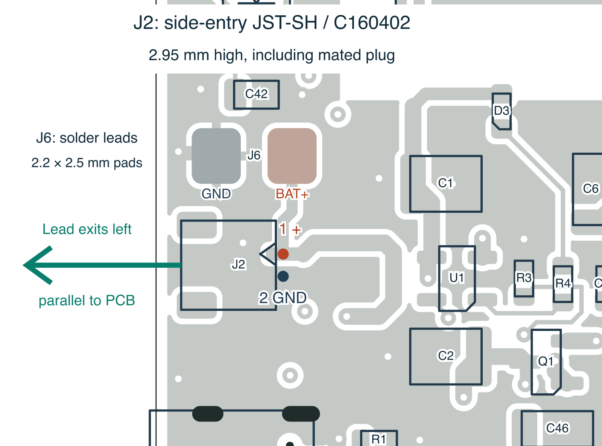

# Battery connector and direct wire pads — 8 October 2026

Fit **JST SM02B-SRSS-TB(LF)(SN), JLCPCB C160402**, a **1.00 mm pitch JST-SH
side-entry SMT header, 2.95 mm high when mated**. Its opening faces the left
PCB edge; the battery lead lies parallel to the board. Use a matching
**SHR-02V-S-B** crimp housing (or SHR-02V-S without handling protrusions),
with **SSH-003T-P0.2-H** contacts and 28 AWG wire. **The existing 2.0 mm JST-PH
battery plug does not fit.** Preserve **pin 1 = battery positive, pin 2 = GND**;
purchased battery leads do not have universal polarity.

**J6 provides two direct battery-lead solder pads above J2.** Each exposed
front copper land is **2.2 × 2.5 mm**, on **3.4 mm centres**, with no holes or
stencil paste. Viewed from the top with USB at the bottom, the **left pad is
GND (pin 2)** and the **right pad is BAT+ (pin 1)**; both are marked on the
front silkscreen. J6 is wired directly in parallel with J2 and adds no height
before soldering. The ground pad uses **0.25 mm thermal clearance and 0.4 mm
copper spokes** to make hand soldering easier. Use either J2 or J6 for **one protected 1S battery**, not two
batteries simultaneously. Secure the cable in the enclosure so pulling it does
not load the solder joints. The charge circuit and its 100 mA setting are unchanged.

J6 is etched PCB copper, excluded from the purchasing BOM and placement files.
No assembly-house component is needed. Its pad centres are **(56.1, 96.0) mm
for BAT+** and **(52.7, 96.0) mm for GND**, in native PCB coordinates.

## Selection and availability

[JST's SH drawing](https://www.jst-mfg.com/product/pdf/eng/eSH.pdf), pages 1
and 3, gives the side-entry land pattern and body dimensions. The assembled
height is 2.95 mm, including the 0.05 mm stand-off beneath the 2.90 mm body.
This is 2.55 mm lower than the previously selected 5.5 mm PH side-entry part
and meets the requested approximately 4 mm maximum. It has a 4.0 mm-wide
housing, two signal lands and two soldered hold-down tabs.

SH is available on some small flat single-cell packs, but ready-made retail
options are narrower than for JST-PH. For example,
[LiPol's protected LP572528 400 mAh / 3.7 V pack](https://www.lipobattery.us/lp572528-400mah-3-7v-1-48wh-lipo-battery-with-pcm-and-cables-50mm-and-jst-shr-02v-s-b/)
is offered with the exact SHR-02V-S-B housing. This demonstrates availability
of the connector family on the target battery format; it does not qualify that
pack's discharge rating or select it for this board. Specify the housing,
28 AWG leads, and pin-1-positive wiring when purchasing the final protected pack.

[JLCPCB C160402](https://jlcpcb.com/partdetail/JST-SM02B_SRSS_TB_LF_SN/C160402)
is an extended-library SMT part available for Economic and Standard assembly.
The fresh public API observation on **2026-10-07** reported **29,259 in stock,
27,621 available to order**, and **USD 0.1319** initial unit price before assembly
charges. Inventory is not reserved. The stock snapshot retains exact MPN,
package, query, retrieval timestamp and response hash; other BOM observations
retain their own dates. Signed media URLs are excluded.

JST rates SH at **1 A with 28 AWG wire**. The user explicitly accepted possible
intermittent excursions above 1 A for this prototype and requested **no new
current limit or operating restriction**. That assumption is recorded, not
promoted to a manufacturer pulse-current rating or a measured thermal result.
The existing **100 mA charge setting** and power circuit remain unchanged.
Battery performance, pack protection/discharge capability and actual peak
waveforms still belong to the existing prototype validation work.

| Compared option | Mated height | Selection consequence |
| --- | --- | --- |
| JST SH SM02B-SRSS-TB / C160402 | 2.95 mm | Retained: side entry, limited ready-made battery selection; J6 also accepts direct leads |
| JST PH S2B-PH-SM4-TB / C295747 | 5.5 mm | Preserved old plug but exceeds the new height target |
| Molex PicoBlade 532610271 / C177225 | 3.4 mm | Common battery lead; formal specification is also 1 A, despite higher reference derating values |
| Hirose DF13A-2P-1.25H(21) / C530976 | 3.6 mm | 2 A specification with two positions and 28 AWG; less common lead for the target packs |

Comparison sources: [JST PH](https://www.jst-mfg.com/product/pdf/eng/ePH.pdf),
[Molex dimensions](https://www.molex.com/en-us/products/series-chart/53261),
[Molex current specification](https://www.molex.com/content/dam/molex/molex-dot-com/products/automated/en-us/productspecificationpdf/510/51021/510211124-PS-000.pdf),
[Hirose specifications](https://www.hirose.com/en/product/p/CL0536-0301-8-21).

## Footprint and placement

The project-local footprint is copied from the installed KiCad library:
`JST_SH_SM02B-SRSS-TB_1x02-1MP_P1.00mm_Horizontal`. The JST top-view land drawing
confirms circuit numbering and these nominal dimensions:

| Land | Local centre, mm | Size, mm | Connection |
| --- | --- | --- | --- |
| 1 | −0.50, −2.00 | 0.60 × 1.55 | VBAT positive |
| 2 | +0.50, −2.00 | 0.60 × 1.55 | GND |
| MP | −1.80, +1.875 | 1.20 × 1.80 | Unconnected hold-down |
| MP | +1.80, +1.875 | 1.20 × 1.80 | Unconnected hold-down |

All four pads have mask and paste openings, with no drilled holes. The
standard KiCad SH STEP model is assigned and resolves in the checked
installation. Library and board lands, body, courtyard and model agree.
KiCad assets retain the library license with design exception.

J2 is locked at **(53.70, 100.90) mm, −90°**. The mating face is at
**X = 51.125 mm**, 1.125 mm inside the left edge. The full courtyard is on
board and the mounting copper starts 0.925 mm inside the edge. The audited
approach corridor to the edge contains no other component courtyard. Leave
enclosure clearance for insertion, the protruding plug and cable bend.

VBAT/GND traces change only near J2; other footprints, board outline, display
and antenna geometry remain unchanged from the prior October correction.
The October 8 J6 addition preserves all 131 existing footprint geometries,
all 1,110 existing trace segments and all 324 vias, adding five local trace
segments. Only the C42 reference text moves to clear the new exposed pads.
The two ground-via and one VBAT-via moves made for PH remain in place.
This footprint is **not compatible with an already fabricated Rev A board**.
The original Rev A files specified vertical B2B-PH-SM4-TB / C160352, so the
received upright part is consistent with those records; they do not establish
a manufacturer substitution.

## Assembly and verification

**Do not substitute a PH, ZH, or top-entry SH header.** Confirm exact C160402,
left-facing opening and pad alignment in the supplier preview. With export
origin (50,160) and Y upward:

| Feature | X, mm | Y, mm | Rotation |
| --- | --- | --- | --- |
| J2 footprint anchor | 3.700 | 59.100 | 270° |
| Pin 1, VBAT positive | 5.700 | 59.600 | — |
| Pin 2, GND | 5.700 | 58.600 | — |
| J6 pin 1, BAT+ wire pad | 6.100 | 64.000 | — |
| J6 pin 2, GND wire pad | 2.700 | 64.000 | — |

CPL coordinates preserve the KiCad anchor without assumed centre offsets.
Use the pad-coordinate CSV for an independent preview check. BOM, CPL,
Gerbers, drill files, paste and schematic/assembly drawings are regenerated
in **battery-pads-2026-10-08**. This supersedes the October 7 SH/PH and September
packages for the next prototype; all earlier archives remain unchanged.

The [connector audit](assembly/battery-connector-check.json) checks exact part,
land dimensions, polarity, orientation, model, paste and plug approach.
Native ERC has zero violations; DRC has zero errors, zero unconnected items,
and zero schematic-parity findings. The 44 remaining DRC warnings are the
41 existing library differences, two ESP32 edge-silk warnings and one back
silk/mask warning. The independent routing and Gerber readback reports cover
the revised connector and the rest of the exported board. The October
USB/display redesigns still require testing on revised hardware.
