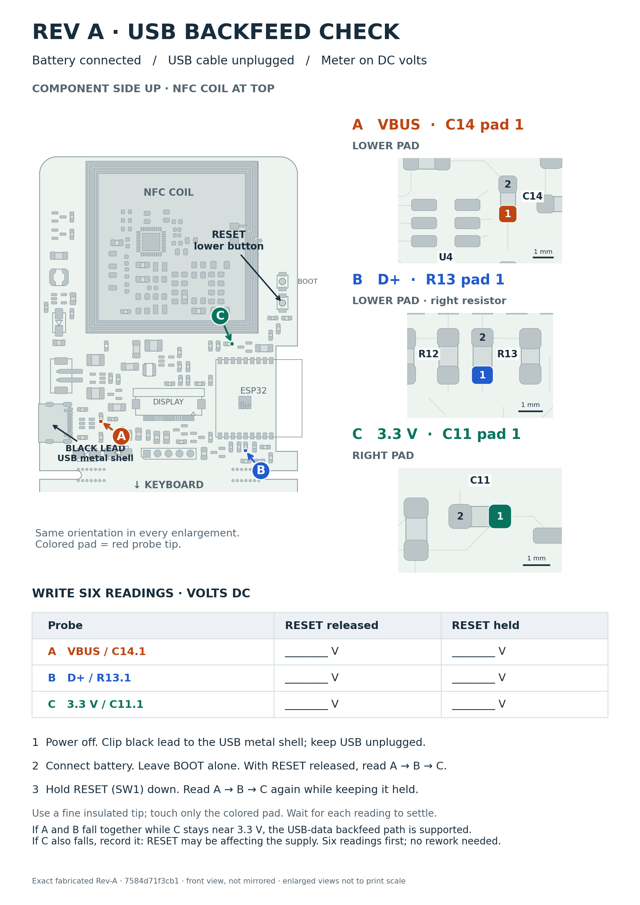

# Rev-A USB backfeed: first bench measurements

[User-annotated one-page guide (PDF)](rev-A-usb-bench-guide.pdf) ·
[Full-resolution image](rev-A-usb-bench-guide.png) ·
[Measurement worksheet (CSV)](usb-backfeed-measurements.csv)

**6 October results are recorded:** VBUS 2.05 → 0.01 V, D+ 2.84 → 0.00 V,
+3V3 3.33 → 3.33 V (RESET released → held, USB disconnected).
The [preserved measurement sheet](measurements/rev-A-usb-battery-2026-10-06.pdf)
and [structured record](rev-A-usb-battery-2026-10-06.json) retain the evidence.
The image below is the original blank guide; the PDF contains the user's notes.

The user has accepted the U4 backfeed diagnosis from these readings and elected
to proceed without pin-isolation rework because the required tools are not
available. Further isolation is optional; the hardware remedy remains to be designed.



## Procedure

1. Disconnect USB and battery. Put the board **component side up, NFC coil at
   the top, keyboard below**. Set the meter to DC volts. Clip its black lead to
   the **USB connector's metal shell**, which is connected to GND. Use a fine
   insulated red probe so it cannot bridge adjacent pads.
2. Connect the battery and let the existing firmware start. Keep USB physically
   unplugged. Leave BOOT alone. With RESET released, record **A, B, C** below.
3. Press and **keep holding RESET (SW1, the lower of the two buttons)**. Record
   **A, B, C** again while it is held. Wait for each reading to settle; record
   the actual voltage, including small residual voltages.
4. Release RESET. Record battery voltage, firmware/mode, meter model/input
   impedance, and any unstable readings. The table below contains the six
   user-reported readings from 6 October; supplementary setup details remain unknown.

| Red probe | Exact pad, in the pictured orientation | RESET released | RESET held |
|---|---|---|---|
| **A — VBUS** | **C14 pad 1: lower pad**, next to U4 near USB | 2.05 V | 0.01 V |
| **B — D+** | **R13 pad 1: lower pad**, the right resistor of R12/R13 below ESP32 | 2.84 V | 0.00 V |
| **C — +3V3** | **C11 pad 1: right pad**, above ESP32 | 3.33 V | 3.33 V |

If VBUS is already near zero after starting on battery alone, repeat the normal
failure sequence: leave the battery attached, connect USB and let it enumerate,
then physically unplug USB and repeat the six readings. Note which sequence
produced each result. Do not leave USB connected during the measurements.

If VBUS and D+ both fall with RESET while +3V3 stays near 3.3 V, this supports
the suspected USB-data-to-VBUS path through U4. It does not alone prove which
component conducts. If +3V3 also drops, investigate the power/reset interaction.
Record a different pattern as observed rather than fitting it to the hypothesis.

No solder rework is needed for this first pass. The
[extended investigation](rev-b-display-and-usb.md#measurements-to-distinguish-the-paths)
covers subsequent load and U4 isolation measurements if needed.

## Map provenance

The graphic uses exact pad polygons and component outlines from the **fabricated
Rev-A commit `7584d71f3cb1b120934be2b80cfab4a015ecddfd`**, viewed from the front
without mirroring. It does not use the changed Rev-B placement. The
[map manifest](rev-A-usb-bench-guide.json) records the verified nets, coordinates,
board hash and original generated output hashes. The user's later PDF annotations
are hashed separately in the measurement record above. All three colored pads are exposed front-side pads;
the USB shell's `SH` pads are GND. Views are enlarged, not to print scale.

Generate a new blank copy with pcbnew/matplotlib-enabled Python. The renderer
refuses to overwrite changed files, preserving handwritten or typed measurements:

```sh
python3 tools/render_rev_a_bench_guide.py --out-stem /tmp/rev-A-usb-bench-blank
```
