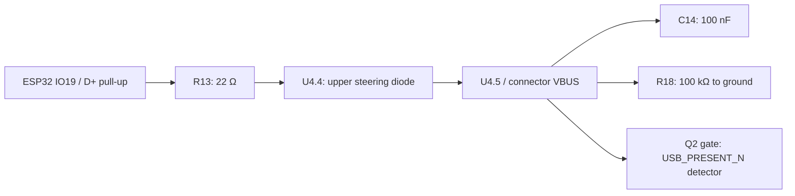

# Rev-A findings: display correction and USB backfeed investigation

6 October 2026. The editable root design builds on revision-B's September routing
repair. The fabricated Rev-A provenance and original measurements remain in
[rev-A-provenance.json](rev-A-provenance.json) and
[rev-A-usb-battery-2026-10-01.json](rev-A-usb-battery-2026-10-01.json).

**Display wiring is corrected and routed. USB backfeed remains an open hardware
finding awaiting a remedy based on the accepted U4 diagnosis. No new fabrication release
is approved by these software checks.** Archived manufacturing ZIPs have not
been updated and still contain the reversed display wiring.

## Display correction

The user confirmed that the mounted ribbon has display pin 1 on the left and
pin 24 on the right, viewed from the PCB component side. The existing Hirose
socket is correctly sized and oriented. It stays at (80.00, 108.85) mm, 180°,
with the same top-contact lands, mounting pads, paste, body and ribbon access.

At this rotation, **Hirose socket pad 24 is PCB-left and socket pad 1 is
PCB-right**. The corrected connection is therefore:

`display ribbon pin n → DS1 socket pad (25 − n)`

The new `SSD1309_COG_24_ReversedSocket` symbol makes the electrical change while
preserving manufacturer pad numbers in the footprint. DS1 symbol numbers are
socket pads; panel functions keep their names. The schematic note, pinout JSON
and PCB `FLEX 1` / `24` legend explicitly identify the mounted ribbon order.

| Display contacts | Socket pads | Connection |
|---|---|---|
| 1, 2, 3 | 24, 23, 22 | GND |
| 4 | 21 | NC, isolated |
| 5, 6 | 20, 19 | +3V0 |
| 7, 8 | 18, 17 | GND |
| 9 | 16 | OLED_RES_N |
| 10, 11, 12 | 15, 14, 13 | GND |
| 13 | 12 | I2C_SCL |
| 14, 15 | 11, 10 | I2C_SDA |
| 16–20 | 9–5 | GND |
| 21 | 4 | OLED_IREF |
| 22 | 3 | OLED_VCOMH |
| 23 | 2 | OLED_12V5 |
| 24 | 1 | GND |

The connector fanout and local OLED routes were rebuilt, ground buses restored
and a ground stitching via added to connect the new front copper island. All
130 footprint positions and all component values/population remain unchanged.
The copper outside the display work, including USB and the NFC matching tree,
is preserved. The current board has 1,044 trace segments and 320 routing vias.
Two reference labels moved to the fabrication layer and one Q5 legend segment
was clipped to clear open vias.

The new [physical contact checker](../../tools/check_display_mapping.py) checks
the left-to-right net sequence independently of schematic parity. Its regression
test deliberately reverses both the schematic and PCB together: they still
agree with each other, but the mounted-panel check rejects them. This closes
the verification gap that allowed Rev-A's electrical reversal to pass ERC/DRC.

Before powering a panel, check continuity from its actual ribbon contacts to
the listed nets, especially display 5/6 (+3V0), 23 (12.5 V), and the grounds.
Then validate reset, I²C response and display operation with the corrected board.

## Backfeed evidence and circuit review

The [6 October measurements](rev-A-usb-battery-2026-10-06.json), transcribed
from the user's [annotated Rev-A sheet](measurements/rev-A-usb-battery-2026-10-06.pdf),
were explicitly confirmed to be taken with USB physically disconnected:

| Battery only | RESET released | RESET held |
|---|---:|---:|
| C14.1 — VBUS | 2.05 V | 0.01 V |
| R13.1 — D+ | 2.84 V | 0.00 V |
| C11.1 — +3V3 | 3.33 V | 3.33 V |

D+ and VBUS fall together while the steady 3.3 V rail stays unchanged. This
strongly supports the suspected USB-data backfeed path and removes a sustained
3.3 V collapse as the explanation for these RESET-held readings. The released
D+−VBUS difference is 0.79 V, consistent with a forward-biased steering diode.
These are steady meter readings, not simultaneous transient captures; U4 has
not yet been physically isolated, so the particular component path is still
an inference. Battery voltage, firmware/mode and meter input impedance were
not supplied.

The earlier sheet's 5.17 V VBUS readings were taken **with USB connected**, as
the user subsequently confirmed. They are retained separately as a powered
control, not battery-only evidence. The original 1 October battery-only result
(approximately 2.1 V, falling near zero on RESET) remains consistent with the
new measurements. The USB reconnect workaround was verified once; ROM
download-mode entry was not independently confirmed.

**Decision, 6 October:** the user does not have the tools for U4 pin-isolation
rework and has instructed us to proceed using the existing measurements as
the basis for the diagnosis. We accept ESP32 D+ → R13 → U4 → VBUS as the
working cause for the redesign. Physical isolation was not performed and is
not a prerequisite for that work. The isolation instructions below remain an
optional diagnostic reference. No backfeed hardware remedy has yet been
implemented or validated.

The saved schematic and PCB retain this possible DC path:

This inference follows the rail-to-rail topology in the
[ST USBLC6-2 datasheet](https://www.st.com/resource/en/datasheet/usblc6-2.pdf).
D1/D2's power-path isolation does not interrupt this data-line path. At 2.05 V,
nominal 100 kΩ R18 alone draws 20.5 µA, so VBUS is being replenished continuously. USB-C source
attachment checks include VBUS reaching vSafe0V; retained VBUS can therefore
explain the observed failure to turn host power back on.
[USB-IF functional test specification](https://www.usb.org/sites/default/files/USB%20Type%20C%20Functional%20Test%20Specification%202024%2003%2003.pdf).

Q2 is not a precision 5 V detector. Its BSS138 threshold specification is
0.8–1.5 V at the stated test current, so 2.05 V at its gate can plausibly assert
`USB_PRESENT_N` even without USB power. Measure the output before relying on
that signal for a firmware-only remedy.
[onsemi BSS138 datasheet](https://www.onsemi.com/pdf/datasheet/bss138-d.pdf).

The [39 added ngspice cases](backfeed-analysis/results.json) exercise the
suspected path, disabled pull-up, isolated U4.5 and passive discharge. They use
the actual R13/R18/C14 values with an assumed 1.5 kΩ pull-up and a range of
illustrative diode parameters. They establish qualitative plausibility, not
the exact measured voltage or a verified repair. With every source removed, the
R18/C14-only model decays from 5.25 V to 0.8 V in roughly 19–21 ms. Cable
capacitance and other leakage are excluded. Total injected current must stay
below about 7.92 µA to keep VBUS under 0.8 V at R18's +1% corner.

## Measurements to distinguish the paths

Start with the [glanceable Rev-A bench guide](rev-A-usb-bench.md), including
the [printable pad map and six-reading table](rev-A-usb-bench-guide.pdf).
Its locations come from the exact fabricated Rev-A board, not the edited layout.

Use the same Rev-A board/firmware as the recorded failure. Record battery
voltage and meter/probe input impedance. Keep USB physically unplugged for
steps 1–4. Clip the black meter lead to the grounded J1 USB metal shell. The
[CSV worksheet](usb-backfeed-measurements.csv) now contains the six first-pass
readings above; the load/isolation and post-repair rows remain unmeasured.

1. With RESET released, then held, measure C14 pad 1 (raw VBUS), R13 pad 1
   (D+ / U4.4), and C11 pad 1 (+3V3). A scope capture of all three during RESET
   is preferable. Also record C12 pad 1 (ESP_EN), C1 pad 1 (USB_5V), C4 pad 1
   (VSYS), R17 pad 2 (USB_PRESENT_N), and R12 pad 1 (D−). If +3V3 collapses
   during RESET, reassess the power path instead of attributing everything to D+.
2. Repeat with a temporary 10 kΩ resistor from raw VBUS to GND, attached with
   power removed. Record VBUS and D+; the added load current is VBUS / 10 kΩ.
   This distinguishes a weak leakage path from sustained data-line drive.
   Remove the resistor afterward. A stronger pulldown is not a permanent fix.
3. With battery and USB disconnected, isolate **only U4 pin 5** from its VBUS
   pad (lift the lead or cut its exclusive branch after tracing it). Preserve
   J1–D1–C14–R18–Q2 continuity. Verify the isolation with an ohmmeter before
   applying battery power. This is a temporary diagnostic rework; it removes
   U4's protection of raw VBUS, so do not treat it as a released modification.
   In the Rev-A component-side view with NFC above and keyboard below, pin 5
   is U4's **middle leg on the right**, toward C14. The
   [top/side-view illustration](rev-A-U4-pin5-isolation.png) shows lifting just
   this lead clear of its pad. Use flux and heat to release the solder before
   lifting gently; do not pry a cold lead or pull up the PCB pad. Under
   magnification, verify a visible gap and no bridges to pins 4/6. With power
   removed, check that the lead has no near-zero-ohm metallic connection to
   its former pad; other semiconductor paths can still give finite readings.
4. Repeat step 1 on battery only, measuring the lifted U4.5 separately from
   C14.1. VBUS falling below 0.8 V while D+ and +3V3 remain high strongly
   identifies U4's branch. If VBUS remains high, investigate D1/D2 reverse
   leakage, charger coupling, contamination/assembly faults and Q2 before
   choosing a power-path redesign. Restore the temporary rework before normal use.

After isolating the source, the permanent design must break data-to-VBUS
injection while retaining both data-line and VBUS ESD protection. A suitable
direction is ground-referenced USB data protection plus a separate VBUS TVS;
its exact part, clamping behavior and footprint need review before routing.
Simply moving U4.5 to USB_5V can instead energize the charger/Q1 gate branch.
Simply leaving it floating omits the original VBUS protection. Neither is
claimed as the final repair here.

The final remedy must also provide VBUS-dependent USB attachment and be checked
in normal firmware and **protocol-confirmed** ROM download mode. Repeat at
least 20 USB-C unplug/replug cycles with the battery attached, both cable
orientations, low/full battery and more than one source/cable. Capture VBUS
decay, +3V3 continuity, D+ attachment and host enumeration; record actual
worst-case values. The 20-cycle count is a project bench screen, not USB certification.

## Validation and reproduction

Current reports: [ERC/pin checks](../verification.json), [DRC](../pcb/drc.json),
[layout](../pcb/layout-check.json), [fabrication](../pcb/standard-fabrication-check.json),
[routing quality](../pcb/routing-quality.json), [mounted display](../oled24/mounted-mapping-check.json),
[Gerber/drill readback](gerber-readback.json),
[261 existing simulations](../simulation/results.json), and
[backfeed analysis](backfeed-analysis/results.json).

ERC has zero violations. Native DRC has zero errors, unconnected items and
parity findings. All 21 layout, 16 fabrication, six routing-quality and eight
mounted-display checks pass; five routing tests and two display regression
tests pass. Forty previously reviewed cosmetic DRC warnings remain. The two
existing USB routing advisories remain: 0.9915 mm skew and two missing In2
ground-reference samples. They are separate from the DC backfeed investigation.

All 12 independent Gerbonara export checks pass, including the corrected
24-contact display net order, lands/mask/paste, component placement population,
all drill locations/sizes and the closed board outline. Excellon coordinates
are compared within half its 0.001 mm output resolution. The native NFC coupon,
coil simulation/geometry, inside-feed geometry and all 12 inside-feed native
regression fixtures also pass. A before/after
[change audit](rev-b-change-audit.json) records preservation of placement,
non-display pad nets, component values/population, board outline and rules.

Use the full sequence in [PCB layout](../pcb-layout.md#reproduce), then run
`tools/check_display_mapping.py`, `tools/test_display_mapping.py` and
`tools/analyze_usb_backfeed.py`. The last tool needs the same numpy/matplotlib
and ngspice environment as the existing simulator. Export only to a fresh
validation directory with `tools/export_standard_fabrication.py --out <directory>`;
then run `tools/check_standard_export.py <directory>` with Gerbonara installed.
The exporter refuses to overwrite archived packages. The historical isolated
OLED/USB regression scripts describe their earlier changes, not this revision.
