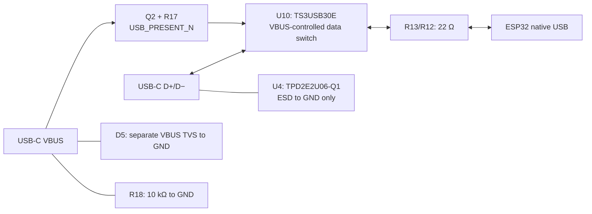
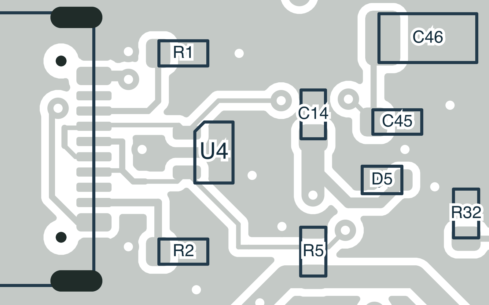
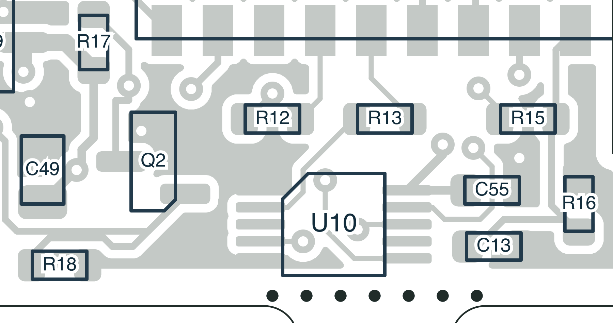

# USB backfeed redesign — 6 October 2026

The editable schematic and PCB remove the accepted Rev-A path from ESP32 D+,
through U4's upper steering diode, into raw VBUS. The measurements and annotated
[Rev-A PDF](measurements/rev-A-usb-battery-2026-10-06.pdf) are preserved. Physical
U4 pin isolation was not performed and is not required for this redesign, as
instructed by the user. Revised hardware has not yet been tested.

## Circuit change

| Reference | New selection or change | Purpose |
|---|---|---|
| U4 | TI TPD2E2U06QDCKRQ1, SC70-3, C915089 | Data protection has no VBUS/supply pin; pins 1/2 are D−/D+, pin 3 is GND |
| U10 | TI TS3USB30EDGSR, VSSOP-10, C131998 | Isolates both USB data lines when VBUS is absent |
| D5 | TI TPD1E10B06DYAR, SOD-523, C3712135 | Separate bidirectional VBUS-to-GND protection |
| C55 | 100 nF, 0603, C1591 | Local 3.3 V decoupling for U10 |
| R17 | 100 kΩ → 10 kΩ | Firm pull-up on the switch's active-low enable |
| R18 | 100 kΩ → 10 kΩ | Faster VBUS discharge and greater margin against leakage |
| C7/C8 | Remove unpopulated USB tuning capacitors | Remove unused data-line branches and make space for U10 |
| R12/R13 | Retain 22 Ω; relocate | Keep series damping between the switch and ESP32 |

U10's **DGS/VSSOP** pin map is 1=S/GND, 2=D1+/R13, 3=unused D2+,
4=connector D+, 5=GND, 6=connector D−, 7=unused D2−, 8=D1−/R12,
9=active-low OE/USB_PRESENT_N, 10=3.3 V. Pins 3 and 7 are explicitly NC.
C13/R16 move locally to provide clearance; their values and battery-monitor
connections remain unchanged. The display socket, its corrected pin order,
board outline, ESP32 placement and NFC circuitry remain unchanged.

When battery-powered with USB absent, Q2 is off and R17 disables U10. With USB
present, Q2 pulls OE low and port 1 connects both data lines. The mechanism
also applies during RESET and ROM download mode, without a firmware command.
**GPIO1 / USB_PRESENT_N must remain an input**, since it shares this hardware
enable signal. U10's power-off protection covers VCC=0; intermediate supply
ramps and hot plugging still need bench validation.

Simply inserting a switch while retaining the old VBUS-steering array could
leave a feedback loop: backfed VBUS could keep Q2 and the switch enabled.
Replacing U4 removes that loop. Its former pin 5 is not left floating, and no
data clamp is redirected into USB_5V or the charger rail.

## Part checks and model limits

[TI's U4 datasheet](https://www.ti.com/lit/ds/symlink/tpd2e2u06-q1.pdf) specifies
a ground-referenced, 5.5 V working-voltage dual TVS with 1.5 pF typical
capacitance. [D5's datasheet](https://www.ti.com/lit/ds/symlink/tpd1e10b06.pdf)
specifies a bidirectional 5.5 V TVS in the DYA/SOD-523 package. JLC calls DYA
“SOT-5X3”; selection follows the exact TI part number and package drawing.
These devices are transient clamps, not precision overvoltage regulators.
The board's ESD performance is not established by the component ratings.

[TI's switch datasheet](https://www.ti.com/lit/ds/symlink/ts3usb30e.pdf) specifies
3–4.3 V recommended supply, 10 Ω maximum on-resistance, 1 µA maximum disabled
I/O leakage and 2 µA maximum power-off leakage. The retained 22 Ω resistors
therefore give up to about 32 Ω external series resistance per conductor.
Full-speed USB packet integrity and enumeration must be tested; this is not a
controlled-impedance or eye-diagram qualification. The external U4 remains
necessary because U10's HBM rating is not board-level IEC ESD qualification.

The layout audit reports 63.1029 mm of D− copper and 50.8970 mm of D+ copper
from connector through the switch to the series resistors: a 12.2059 mm
imbalance, exceeding its 0.5 mm advisory target. This sum includes connector
branches and is not an extracted propagation delay. Two existing In2 ground
reference gaps remain near the connector, among 2,097 sampled back-layer
trace points. These advisories remain visible; neither DRC nor the DC model
qualifies USB signal integrity.

New-part public catalogue availability was observed on 6 October: U4 5,424,
U10 2,201, D5 4,647. These are dated observations, not reserved inventory.
The [assembly snapshot](../assembly/jlc-stock-snapshot.json) records sources,
timestamps, package alias and response hashes. The BOM now has 119 populated
components per board, 129 schematic components and 131 PCB footprints including
the mechanical breakaway patterns.

## Validation and follow-up

[The independent USB check](usb-backfeed-check.json) checks the exact circuit
and package pins. Fault-injection tests reconnect the TVS to VBUS, force the
switch on, select the wrong port, use the wrong supply and bridge the unused
port. They must fail even when the altered schematic and PCB agree.

[SPICE screening](backfeed-analysis/results.json) retains 36 historical Rev-A
DC cases with the **old 100 kΩ R18**, plus three revised discharge cases and
18 revised DC cases: 57 total. The revised cases assume the switch truth table
and Q2 state; they are not complete IC models. With a 15 kΩ host pull-down and
the modeled disabled leakage, connector D+ stays below 20 mV. A separate
10 µA VBUS injection stress gives at most 101 mV through the new 10 kΩ +1%
bleeder. The bleeder discharges 100 nF from 5.25 V to 0.8 V in approximately
1.88 ms nominal after **all** sources are removed. It draws 0.525 mA at 5.25 V.
Neither calculation reproduces every unplug transient or proves zero leakage.

On the revised assembled board, repeat battery-only RESET released/held readings
at C14.1 (VBUS) and C11.1 (3.3 V). Check connector-side D+ at **U4.2**; R13.1 is
now behind the switch and can legitimately remain high while disconnected.
With no host attached the connector-side data pins can float; the model's
20 mV result assumes a 15 kΩ host pull-down and is not a no-load meter limit.
With USB absent, U10.9 should be near 3.3 V and VBUS near ground. With USB
present, U10.9 should be low. Verify enumeration, ROM flashing, repeated
unplug/replug, battery-only operation and USB-powered startup without a battery.
The old Rev-A pad map remains an evidence record and does not describe U4's
new three-pin package.

Validation: ERC has zero violations; DRC has zero errors, zero unconnected
nets and zero schematic-parity findings. Its 45 reviewed cosmetic warnings
comprise 42 library/legend differences, two existing ESP32 edge/legend warnings
and one back-artwork/mask overlap clipped in the export. All 22 layout checks,
16 fabrication checks, six routing checks, eight display checks, 14 USB
topology checks and 13 Gerber/drill/stencil checks pass. The 13 regression
tests, 261 preflight SPICE cases, 57 USB SPICE cases and 12 native NFC
fixtures also pass within their documented scopes. The two USB layout
advisories above remain unmet. The [validation record](usb-backfeed-validation.json)
binds reports to the saved design. Validation exports are not a new manufacturing
release; historical manufacturing archives remain unchanged.

## Current PCB detail

These drawings show the **revised design**, not the fabricated Rev-A board.

