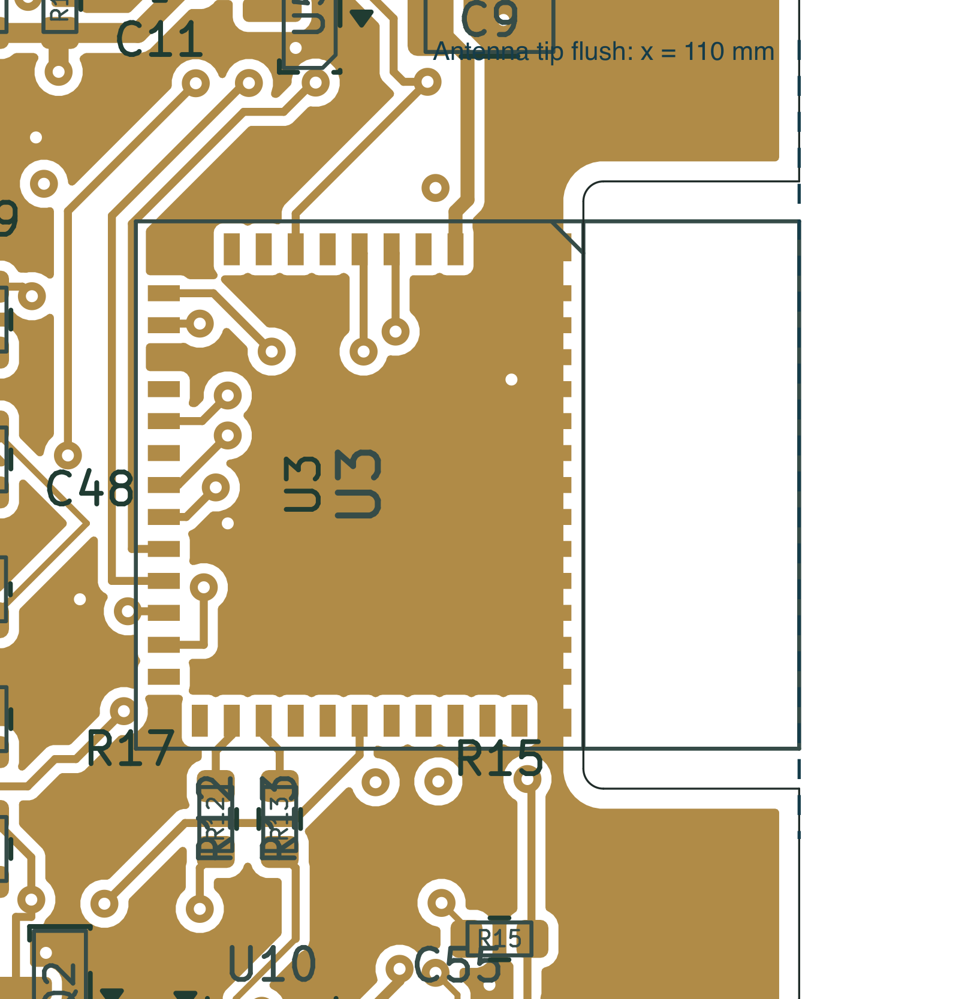

# ESP32-C3-MINI-1 compatibility and antenna fit

The current design uses **ESP32-C3-MINI-1-H4X, JLCPCB C41349510** in place of
WROOM-02-N4. Electrical interfaces are compatible after changing the physical
pad numbers and PCB routing. This is a new PCB revision: the modules are not
interchangeable on the old footprint.

The 4 MB H4X part is recommended by Espressif and was available in JLCPCB's
public catalog on 8 October 2026 (829 available to order at that observation;
inventory is not reserved). The older MINI-1-N4 is NRND. H4X has a higher ambient
temperature rating than the former N4 module; this does not raise the assembled
board's temperature rating. The catalog search did not expose the H4X assembly
process field, so automated assembly still requires the supplier's placement
preview and quotation. The prototype supports the established manual reflow process.

The module body changes from 18 × 20 × 3.2 mm to **13.2 × 16.6 × 2.4 mm**:
39.1% less module area and 0.8 mm less module height. The full PCB remains
60 × 110 mm, including its detachable keyboard. Other components still set the
overall assembly height.

## Electrical compatibility

The 3.0–3.6 V supply range, 500 mA external supply requirement, boot straps,
native USB Serial/JTAG, ADC1 battery measurement, shared 100 kHz I²C bus, Wi-Fi
and BLE functions are retained. The regulator, EN supervisor and RC timing,
VBUS-controlled USB isolation, display circuitry, NFC circuit and keyboard are
unchanged. There is no GPIO reassignment in firmware.

| Function | GPIO | Old WROOM pad | MINI pad |
|---|---:|---:|---:|
| 3.3 V | — | 1 | 3 |
| EN/reset | — | 2 | 8 |
| I²C SDA | 4 | 3 | 18 |
| I²C SCL | 5 | 4 | 19 |
| NFC IRQ | 6 | 5 | 20 |
| NFC VEN | 7 | 6 | 21 |
| GPIO8 strap | 8 | 7 | 22 |
| BOOT | 9 | 8 | 23 |
| OLED reset control | 10 | 10 | 16 |
| Keyboard interrupt | 20 | 11 | 30 |
| Reserved, NC | 21 | 12 | 31 |
| USB D− | 18 | 13 | 26 |
| USB D+ | 19 | 14 | 27 |
| OLED power control | 3 | 15 | 6 |
| GPIO2 strap | 2 | 16 | 5 |
| USB present, inverted | 1 | 17 | 13 |
| Battery ADC | 0 | 18 | 12 |

MINI ground pins 1, 2, 11, 14 and 36–53 all connect to GND. Factory NC pads
4, 7, 9, 10, 15, 17, 24, 25, 28, 29 and 32–35 remain isolated. The optional
centre joint, pad 49, is masked without paste or thermal holes; Espressif
permits omitting that solder joint. All perimeter pads have mask and paste.

R12/R13 retain 22 Ω and move beside the module. Both resistor-to-module USB
routes are 1.800685 mm, on F.Cu without vias. The independent routing audit
checks every trace for full entries, centreline joins, 45-degree geometry and
short/duplicate/acute segments. Earlier connector-to-switch USB skew and two
reference-plane sampling gaps remain documented layout advisories; this change
does not qualify USB signal integrity or arbitrary host operation.

## Firmware

H4X contains ESP32-C3 chip revision **1.1**. The user confirmed **ESP-IDF 5.4 or
newer**, which meets the chip revision's framework compatibility requirements.
Firmware is not present in this repository, so existing binaries have not been
built or boot-tested here. Espressif also lists support
from 4.3.7, 4.4.7, 5.0.5, 5.1.3 and 5.2, depending on release branch; non-UART0
primary consoles need the additional fixes in 5.0.8, 5.1.6, 5.2.4 or 5.3.2.
For Arduino or another framework, check its bundled ESP-IDF version. Keep the
4 MB flash configuration and GPIO assignments. Test ROM download, boot/reset,
USB reconnect, Wi-Fi/BLE and peripherals on the first revised board.

## Flush antenna and cutout

U3 is locked at **(101.70, 106.14) mm, −90°**. Its physical antenna tip is at
**x = 110.00 mm**, exactly aligned with the PCB's right outer edge in nominal
CAD geometry. The antenna area is x = 104.60–110.00 mm,
y = 99.54–112.74 mm. No baseboard material or copper remains beneath it.

The notch is x = 104.60–110.00 mm, y = 98.54–113.74 mm, with **1.00 mm clearance
on either side of the antenna** and **0.50 mm internal corner radii**. It opens
to the right edge. Module and board tolerances mean an assembled unit may not
be perfectly flush; the design adds no intentional overhang.

The manufacturer's antenna-side ground lands end at x = 104.30 mm, leaving
**0.30 mm copper-to-cutout clearance**. A custom DRC rule requires at least
0.25 mm for U3 ground lands only. Other copper retains the existing 0.50 mm
edge rule. This dimension and the milled notch must be accepted by supplier CAM.
The OLED ribbon access and keyboard breakaway remain. The current production
release restores the rev-A NFC layout and requires filled/capped vias and the
rev-A stackup; see the production instructions. The antenna keepout prohibits pads, tracks, vias and pours
on all four copper layers. Ground stitching sits on the module side of the cutout.

Espressif recommends this open notch arrangement when the antenna cannot
project past the outer edge. Final enclosure clearance, antenna range and RF
performance still need measurement; CAD clearance is not RF qualification.

## Validation and source records

Current checks: zero schematic ERC violations; zero native DRC errors,
unconnected items or schematic-parity findings; 43 cosmetic DRC warnings;
17 MINI compatibility/fit checks, 16 fabrication checks and all six independent
routing-quality checks pass. USB backfeed, display mapping and battery checks
remain applicable. The required 261 scoped ngspice cases were rerun against
the updated design with no solver errors. Component values and peripheral
topology are unchanged; these models do not simulate the new layout's parasitics,
complete ICs or MCU firmware.

All 32 independent export checks pass for the current mounting package, covering Gerber
copper, solder mask, stencil apertures, drill data, placement data and the
resized board outline.

- [MINI pin/fit verification](pcb/mini-module-check.json)
- [Native DRC](pcb/drc.json) and [routing quality](pcb/routing-quality.json)
- [Footprint amendments](pcb/mini-footprint-amendments.json) and [outline amendment](pcb/mini-outline-amendment.json)
- [Espressif MINI-1 datasheet v2.2](https://documentation.espressif.com/esp32-c3-mini-1_datasheet_en.pdf), tables 1-1, 3-1, 6-2 and figures 10-1, 11-1
- [Espressif module placement guidance](https://docs.espressif.com/projects/esp-hardware-design-guidelines/en/latest/esp32c3/pcb-layout-design.html#general-principles-of-pcb-layout-for-modules-positioning-a-module-on-a-base-board)
- [Espressif chip/SDK compatibility](https://github.com/espressif/esp-idf/blob/master/COMPATIBILITY.md#esp32-c3)
- [Espressif source footprint and model](https://github.com/espressif/kicad-libraries), licensed as recorded in [library notes](../libraries/README.md)
- [Exact selected JLCPCB part](https://jlcpcb.com/partdetail/Espressif-ESP32_C3_MINI_1H4X/C41349510)

Run `tools/check_mini_module.py` with KiCad's Python after schematic export and
native DRC with zone refill. Use the **production-2026-10-08** manufacturing package;
the previous MINI and WROOM packages remain historical records.
