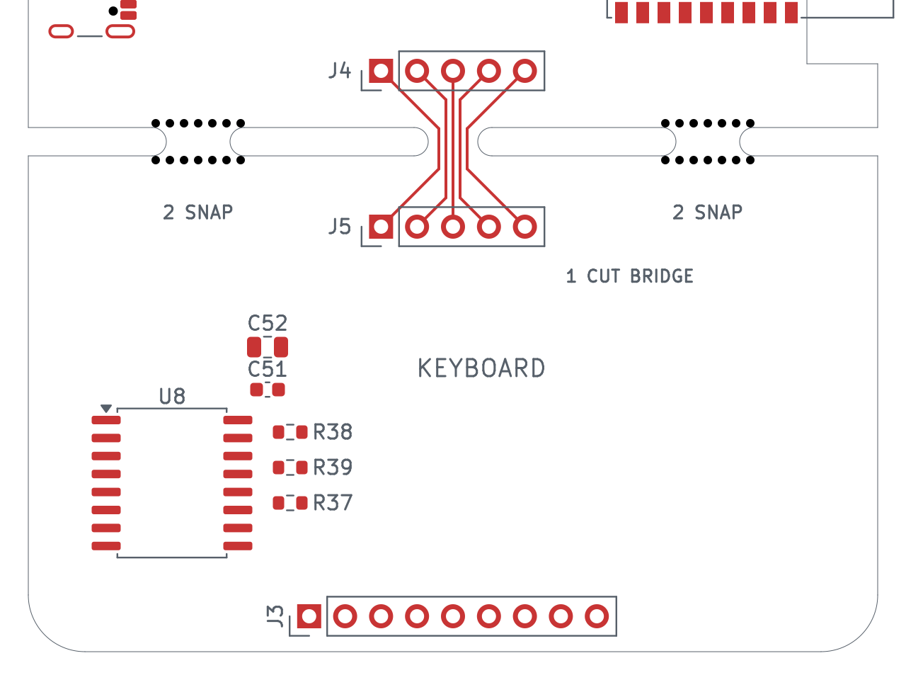

# Detachable 35 mm keyboard section

The board remains 60 × 110 mm, from X = 50–110 and Y = 50–160 mm.
The keyboard body occupies Y = 125–160 mm: **60 × 35 mm**. A 2 mm routed
gap at Y = 123–125 mm separates it from the main body, which is 73 mm high.
Small tab remnants remain after separation and may need trimming.

## Mechanical connection

Two perforated support tabs, MB1 and MB2, are centered at X = 62 and 98 mm.
Each has a 4.5 mm minimum neck width and two rows of seven **0.60 mm NPTH
holes on 1.00 mm centers**. The 0.40 mm material between holes and 2 mm
routing gap follow the dimensions in
[JLCPCB's mouse-bite guide](https://jlcpcb.com/blog/mouse-bite-panelization-guide),
checked 2026-09-21. There are 28 added non-plated holes in total.

The two edge notches form part of the outer Edge.Cuts outline; the two
interior slots are closed cutouts. There is no routed line across the tabs.
MB1/MB2 are board-only mechanical footprints, excluded from the assembly BOM
and placement files. Their drill holes remain included in fabrication output.

## Electrical connection and separation

A separate **3.5 mm-wide central bridge** at X = 80 mm carries five 0.20 mm
F.Cu tracks between J4 and J5. The perforated support tabs carry no copper.
The trace order is identical on both optional five-pin headers:

| Pin | Connection |
|---|---|
| 1 | +3V3 |
| 2 | GND |
| 3 | SDA |
| 4 | SCL |
| 5 | INT_N |

Leave the section attached during assembly and normal use. To detach it:

1. Disconnect USB and the battery.
2. Support both sections and **cut through the central FR-4 bridge and its
   five traces**, at approximately Y = 124 mm. Do this before bending the board;
   do not rely on tearing the copper traces apart.
3. Separate the two perforated support tabs while supporting the board close
   to the tabs. Trim rough remnants and inspect the cut conductors for shorts.
4. If the detached keyboard will still be used, fit J4/J5 or solder a short
   five-wire connection, matching pins 1–5 straight through.

The silkscreen marks `1 CUT BRIDGE` and `2 SNAP`. The intended central cut
is drawn on Dwgs.User only; it is **not** a manufacturing Edge.Cuts feature.
J4 and J5 remain DNP/user-fitted parts.

## Placement and routing

U8 (PCF8574T) and the centered J3 keyboard header retain their existing
positions. C51, C52, R37, R38, R39 and J5 are placed on the lower section;
J4 is placed on the main board above the gap. The display connector, battery
connector, NFC assembly and ESP antenna notch retain their placement/geometry.

A rule-area band from Y = 121.9–126.1 mm excludes copper pours and vias on
all four copper layers. Additional areas prohibit inner/back-layer tracks
and front-layer tracks through the mechanical tab regions. The five deliberate
front-layer bridge traces are allowed. Keep component bodies and pads away
from the fracture band when continuing placement.

All keyboard and main-board routing is complete. The five original J4-to-J5
bridge connections and the fracture-band restrictions are preserved; see the
[current layout checks](pcb-layout.md).

## Verification and fabrication

The [original breakaway verification](keyboard/breakaway-check.json) records the
mechanical construction before full-board routing:

- One connected board outline with two closed internal slots.
- All eight keyboard-region footprints within the lower 35 mm section.
- The 28 NPTH holes, their pitch, and their presence in the separate NPTH drill file.
- Five continuous J4-to-J5 paths with the correct nets.
- Plane/via keepouts on all four layers and library matches for MB1/MB2.
- Preservation of the other 121 existing footprints and all original pad nets.
- No new DRC violations: the same 18 existing findings remain, with 303
  unconnected items still to route.

That report is historical. The [manufacturing package](manufacturing-release.md)
contains freshly checked Edge.Cuts and separate PTH/NPTH drills, with zero
unconnected items. Its independent drill readback confirms all 28 mouse bites.
Identify this as an intentional functional breakaway that must remain attached
through assembly and delivery. Confirm the fabricator's interpretation of the
tabs and central cut bridge during CAM review.
