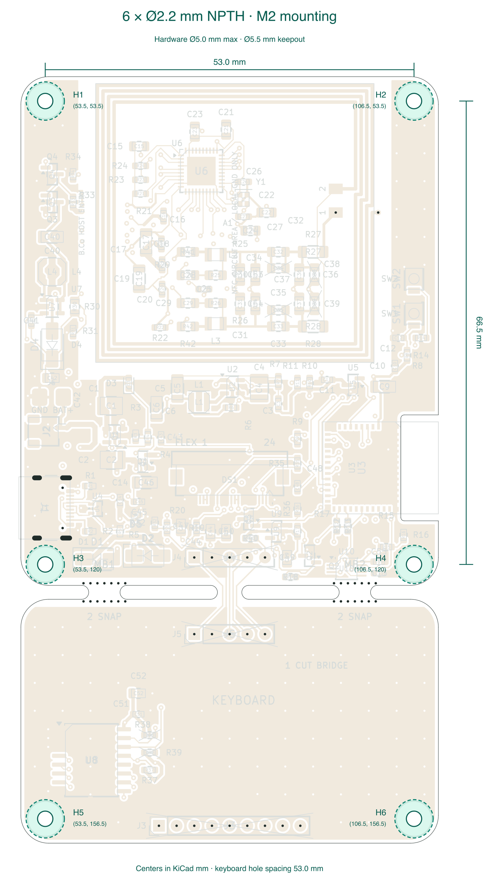

# Six M2 mounting holes

The current PCB has **six 2.2 mm non-plated clearance holes**: H1–H4 at the
four corners of the main board and H5/H6 at the lower two corners of the
detachable keyboard. These are through holes for M2 screws, without threads,
countersinks, copper annuli or stencil paste. Screws and standoffs are supplied
separately; select screw length for the actual enclosure and mounting stack.

Coordinates are in KiCad millimetres, viewed from the top, with Y increasing
down the drawing. The outer board spans X = 50–110 and Y = 50–160 mm.

| Hole | Location | KiCad X | KiCad Y | X from left edge | Y from top edge |
|---|---|---:|---:|---:|---:|
| H1 | Main upper left | 53.5 | 53.5 | 3.5 | 3.5 |
| H2 | Main upper right | 106.5 | 53.5 | 56.5 | 3.5 |
| H3 | Main lower left | 53.5 | 120.0 | 3.5 | 70.0 |
| H4 | Main lower right | 106.5 | 120.0 | 56.5 | 70.0 |
| H5 | Keyboard lower left | 53.5 | 156.5 | 3.5 | 106.5 |
| H6 | Keyboard lower right | 106.5 | 156.5 | 56.5 | 106.5 |

The main-board mounting rectangle is **53.0 × 66.5 mm**. The lower keyboard
holes are **53.0 mm apart**. Main lower holes sit 3.0 mm above the Y = 123 mm
separation edge; their vertical position clears the existing USB connector.
All six positions are locked. The 60 × 110 mm envelope, corner radii, antenna
notch, routed breakaway slots and mouse bites retain their previous geometry.

Each hole reserves a **5.5 mm diameter copper and component clearance** on
both faces and all four copper layers. Use screw heads, washers and standoffs
no larger than **5.0 mm across** at the PCB; this allows 0.25 mm radial margin.
Standard M2 washers are nominally 2.2 mm inside / 5 mm outside, as listed by
[Bossard](https://nederland.bossard.com/en-us/standard-fastening-elements/washers/washers-flat-without-chamfer/125a00200020000).
The entire seating area fits within the rounded outline. Enclosure fit,
tightening torque, mechanical strength and RF behaviour with actual hardware
remain physical checks; the circuit model does not model nearby metal.

## Local changes

R16 (470 kΩ, battery ADC divider) moves from **(104.00, 120.00)** to
**(105.00, 115.75)** mm, retaining its 90° rotation, value and pin connections.
Its short ADC connection and the nearby branch to C13 are rerouted. Eleven
ground-stitching vias inside the mounting clearances are removed. All other
component placements, the USB routes, GPIO assignments, the NFC winding and
the five functional keyboard bridge traces are preserved.

H1–H6 are board-only mechanical footprints, excluded from BOM, placement and
stencil data. The assembly still contains 119 populated parts. The separate
NPTH drill file now has **36 holes**: six 2.2 mm mounts, two 0.65 mm USB
locators and 28 0.60 mm mouse bites.

## Validation

- Native KiCad ERC: zero violations. DRC with zone refill, all-track errors
  and schematic parity: zero errors, zero unconnected items and zero parity
  findings; the same 43 cosmetic warnings remain.
- Ten independent mounting checks verify the hole count, positions, drill
  type/size, hardware area, pad/component clearance and copper on every layer.
- Existing layout, MINI, battery, display, USB, fabrication and all six
  routing-quality checks pass. The existing USB skew/reference-plane advisory
  findings remain; this mechanical change does not qualify USB performance.
- The 261 scoped simulation cases were rerun against the revised board, with
  no solver errors. Electrical component values and topology are unchanged.
- The manufacturing export is checked independently for drill sizes and
  positions, preserved mouse bites/USB slots, and exclusion of H1–H6 from
  assembly and stencil data.

[Mounting checks](pcb/mounting-holes-check.json) ·
[Footprint amendment record](pcb/mounting-footprint-amendments.json) ·
[Native DRC](pcb/drc.json) · [Routing audit](pcb/routing-quality.json)

Use the **production-2026-10-08** manufacturing package. The earlier MINI and
battery/connector packages remain unchanged historical records.
