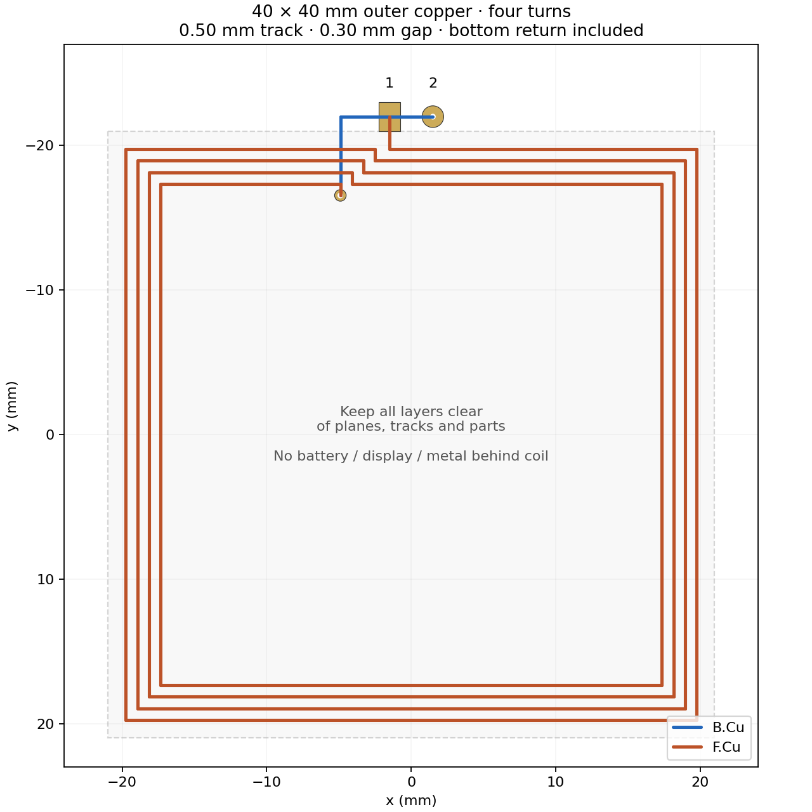

# NFC coil, matching calculations and prototype tuning

2026-09-20 · KiCad 10.0.6 · **prototype starting design, not measured RF performance**.

The project now has a reusable **40 × 40 mm, four-turn etched PCB antenna**
assigned to A1 and a populated starting matching tree. The geometry uses the
user-confirmed **0.50 mm track, 0.30 mm gap and 35 µm copper**. The coil area
must remain clear of battery, display and other metal. No ferrite is modeled.

The Elechouse PN7160 circuit topology is retained, including the receiver taps.
Its supplied schematic does **not** give RF values or a dimensioned coil layout.
This is therefore a close dimensional implementation with a calculated matching
network, not a verified reproduction of Elechouse's antenna or read range.
Four turns were selected with the user; the exact Elechouse turn count remains
unverified. Component values are calculated for this geometry.

[RF schematic](nfc/schematic.pdf) · [coil drawing](nfc/coil.svg) ·
[native KiCad coupon plot](nfc/coupon.svg) · [calculation results](nfc/calculations.json) ·
[impedance sweep](nfc/impedance-sweep.svg) · [BOM](bom.csv).



## Place it in KiCad

Open `nucula-v2.kicad_pro`. A1 on the NFC sheet uses:

- Symbol: `Nucula_Project:NFC_PCB_Loop_40x40_4T`.
- Footprint: `Nucula_Project:NFC_PCB_Loop_40x40_4T_W0.50_S0.30`.
- Pins **1 and 2 are the coil ends**. There is no ground pad, shield or center tap.

Use **Tools → Update PCB from Schematic (F8)** when starting the main layout.
The main PCB remains unplaced; this task establishes the reusable component,
schematic and a separate measurement coupon. In another project, register the
local `.pretty` and `.kicad_sym` libraries first. No global library changes are needed.

The spiral is actual connected **custom-pad copper**, not lines on a drawing
layer. The four turns are on F.Cu. Two 0.40 mm plated holes and a B.Cu underpass
bring the inner end to the adjacent terminal outside the coil. Moving or rotating
A1 carries all copper, holes and keepout together. Do not explode it or route an
extra connection between its terminals.

KiCad requires the footprint's `net_tie_pad_groups "1,2"` declaration because an
etched inductor is DC-continuous between two schematic nets. That declaration
represents the coil's intended copper continuity, **not permission to bypass it**.
The inner via and its short front landing use pad 2; the remaining spiral uses
pad 1. This also preserves native drill-clearance checking at the plated hole.

The footprint includes a **42 × 42 mm rule area on all copper layers**, covering
the full aperture and a 1 mm perimeter margin. It prohibits other footprints,
tracks, vias and zone fills. Pads are allowed because the antenna itself is built
from pads; the footprint exclusion blocks unrelated component placement. The
front/back courtyards extend to the feed lands, overall **42 × 44.5 mm**.
Allow additional room for silkscreen and the matching tree. The 1 mm margin is a
layout guard, not a universal electromagnetic isolation distance.

Use a two-layer **1.6 mm FR4** board for the first prototype, following the
Elechouse module's published thickness; dielectric constant **4.3 is an assumption**.
The underpass is already part of the footprint. Do not add a ground plane,
shield, mounting screw, battery, display frame or cable loop in/behind the aperture.
Changing stackup, copper thickness, coating, nearby conductors or feed routing
requires measurement and retuning. Keep soldermask on the spiral; the two feed
lands are exposed, the inner hole is tented, and the antenna has no paste openings.

## Initial component values

Values below are **per physical branch**, not differential equivalents. Fit equal
values on both sides. Tight pair matching matters as well as absolute tolerance.

| Project references | Function | Initial assembly | Package / requirements |
|---|---|---|---|
| L2, L3 | EMC series inductors | **150 nH** | Coilcraft **0805HP-151XGRC**, 2%; manufacturer land pattern |
| C30, C31 | EMC main capacitor | **330 pF** | 0805 hand-solder, C0G/NP0, 100 V, 1% |
| C53, C54 | Populated parallel EMC capacitor | **33 pF** | 0805 hand-solder, C0G/NP0, 100 V, 5% |
| C32, C33 | Series matching C1 | **68 pF** | 0805 hand-solder, C0G/NP0, 100 V, 1% |
| C34, C35 | Parallel series-cap trim | **DNP** | 0805 hand-solder, no paste |
| C36, C37 | Antenna-side shunt C2 | **100 pF** | 0805 hand-solder, C0G/NP0, 100 V, 2% |
| C38, C39 | Parallel shunt trim | **DNP** | 0805 hand-solder, no paste |
| R27, R28 | Series Q damping | **2.7 Ω** | 1206 hand-solder, 1%, **CRCW12062R70FKEAHP** |
| C28, C29 | Receiver AC coupling | **1 nF** | 0805 hand-solder, C0G/NP0, 100 V, 5% |
| R25, R26 | Receiver series resistance | **2.2 kΩ** | 0805 hand-solder, 1%, ≥0.125 W |
| R41, R42 | Removable TX isolation links | **0 Ω, fitted** | 0805 hand-solder, ≥0.5 A jumper rating |
| A1 | Etched PCB loop | Manufactured copper | Excluded from purchased BOM and pick/place |

The 10-board sourcing review replaces the difficult-to-source 360 pF ±2%
part with **330 pF ±1% + 33 pF ±5% in parallel on each leg**, using the existing
C53/C54 pads. Both parts remain 100 V C0G/NP0 in hand-solderable 0805.
The sum is 363 pF with worst-case tolerance ±(3.30 + 1.65) = **±4.95 pF
(±1.364%)**, range 358.05–367.95 pF. Nominal capacitance increases 0.833%;
this is a recalculated starting value, not an identical 360 pF replacement.
The Python and full differential SPICE models include both capacitors with
separate assumed 0.03 Ω ESRs. The uncertainty sweep uses their individual
1%/5% tolerances and the selected 68 pF part's 1% tolerance.

C34/C35 and C38/C39 remain **four free, no-paste manual tuning pads**.
C53/C54 are now populated and have normal paste apertures; change these
small parallel values in matched pairs when adjusting the EMC stage.
Exact JLCPCB codes, stock constraints and the 10-board BOM are in the
[assembly audit](assembly-readiness.md). Do not substitute arbitrary 150 nH
inductors or ordinary low-power 2.7 Ω resistors without rechecking the RF model.

The 150 nH / 363 pF EMC pair gives a nominal **21.57 MHz** LC resonance. It is
close to NXP's 160 nH / 330 pF example; the selected Coilcraft part has an
accessible frequency-dependent model and an 0805 package. Both values were
recalculated together. The old `0805HQ` land pattern is not reused for the
different `0805HP` body. Its new pads are **1.02 × 1.98 mm**, separated by 1.12 mm.

The inductor's published Q of 80 is at **250 MHz**, not 13.56 MHz. Its model
instead gives approximately **0.860 + j12.680 Ω at 13.56 MHz** (Q ≈ 14.7).
Using the RF model prevents that high-frequency Q specification from making
the matching calculation artificially optimistic. Its 0.60 A rating is a
specified temperature-rise reference, not a guaranteed RF current limit.
[Coilcraft specifications](https://www.coilcraft.com/en-us/products/rf/ceramic-core-chip-inductors/0805-%282012%29/0805hp/0805hp-151/).

The damping resistor is the **HP** part, not the ordinary quarter-watt CRCW1206.
The current datasheet allows 0.75 W at 70 °C only with board thermal resistance
≤110 K/W. Use **0.5 W as a provisional upper design allowance**, verify actual
temperature, and initially operate at TVDD ≤3.3 V. Small RF pads may not provide
the datasheet's cooling conditions.
[Vishay datasheet](https://www.vishay.com/docs/20043/crcwhpe3.pdf).

Exact capacitor purchasing codes remain selectable to those specifications;
the values, packages, tolerance and voltage are fixed as prototype requirements.
Do not substitute X7R/X5R for the matching capacitors. Optional trim pads have
no F.Paste aperture, so they remain convenient for manual additions after reflow.

## What was calculated

### Coil geometry and inductance

The 40 mm specification is measured at the **outer copper edges**. Thus the
outer track centerline is 39.50 mm square. Track pitch is 0.80 mm, and the clear
inner opening is 34.20 mm. The stepped transition occupies a small region on the
top edge. Planar copper centerline length, including feeds and underpass, is
**607.50 mm**; the two assumed 1.6 mm barrels bring the path to **610.70 mm**.

For the Mohan current-sheet expression, in SI units:

```text
din = dout - 2[N*w + (N-1)*s] = 0.0342 m
davg = (dout + din)/2         = 0.0371 m
rho = (dout - din)/(dout+din) = 0.0781671

L = μ0*N²*davg*1.27/2 * [ln(2.07/rho) + 0.18*rho + 0.13*rho²]
```

| Method | Result | Interpretation |
|---|---:|---|
| Mohan current-sheet expression | **1.5590 µH** | Chosen nominal model |
| Modified Wheeler expression | **1.4367 µH** | Independent closed-form cross-check |
| Neumann segment integration, strip self terms | **1.5529 µH** | Includes generated feeds, return and approximate barrels |

The Neumann calculation sums signed mutual terms between the actual straight
segments; orthogonal segments have zero `dl·dl` contribution. Strip self terms
use approximate geometric mean distance `0.2235*(w+t)`. This is a magnetostatic,
uniform-current approximation, not a full-wave field solve or a model of
proximity-effect current redistribution. Feed closure on the eventual main PCB
and nearby conductive objects are absent. Agreement between two methods does
not imply sub-percent production accuracy. The Wheeler disagreement and the
unknown installation justify sweeping **±10% L** as an engineering scenario.
[Original Mohan paper](https://web.stanford.edu/~boyd/papers/pdf/inductance_expressions.pdf),
equations 1–2 and tables I–II. Its original measured accuracy applies to its
own test geometries and is not a guarantee for this larger PCB coil.

### Resistance and parasitic capacitance

Using copper resistivity `1.724e-8 Ω·m` at 20 °C gives approximately **0.598 Ω DC**
for the planar traces. Skin depth at 13.56 MHz is **17.95 µm**. A two-surface
penetration approximation gives **0.937 Ω** before proximity, corners, vias,
finish and solder losses. This approximation does not solve the AC loss problem.

The matching model therefore uses an explicitly **assumed Ra = 1.5 Ω** and
**Ca = 2.0 pF**. NXP's similar 40 mm / four-turn example provides a useful
sanity check, but its measured parameters are not substituted as measurements
of this footprint. Ca is particularly sensitive to stackup, mask and routing.
No precision electrostatic extraction has been performed. **Ra and Ca remain
the largest unmeasured model inputs.**

Model the bare coil as `(Ra + jωLa) || 1/(jωCa)`. The assumed self-resonance is
**90.1 MHz**; it is not an observed result. NXP recommends keeping it above
25 MHz. With Ca present, `Im(Z)/ω` at the operating frequency is an *apparent*
series inductance, not exactly the physical La. Do not enter that apparent
value as La and then add the full Ca again.

### Complete differential matching network

The physical network on each side is:

```text
TX → 0Ω isolation → L0 → EMC node → C1 → match node → Rq → coil end
                         │                │
                         C0               C2
                         │                │
                        GND              GND
                         │
              EMC node → Rrx → Crx → RX input
```

The RXN/RXP association is preserved from the supplied Elechouse schematic.
For calculation, odd-mode symmetry reduces the balanced network to one half.
The floating coil impedance is halved; **each physical C0/C1/C2 retains its
full per-leg value** in that half circuit:

```text
Za = [(Ra + jωLa)^-1 + jωCa]^-1
Zd = Rq + Za/2
Zp = Zd || ZC2
Zs = ZC1 + Zp
ZC0 = ZC330 || ZC33
Z0 = ZC0 || Zs || Zrx
Zdiff = 2 * (ZL0 + Z0)
Rq = [Im(Za)/Qtarget - Re(Za)] / 2
```

`ZC = 0.03 Ω + 1/(jωC)` assumes capacitor ESR; no measured S-parameters for
the chosen MLCCs exist yet. `ZL0` uses Coilcraft's published network
`R2 + [(Rvar+jωL) || (R1+1/jωCpar)]`, with `Rvar=k√f`, `R2=.288 Ω`,
`R1=10 Ω`, `L=148.8 nH`, `Cpar=.135 pF`, `k=1.554e-4`.

RX loading assumes 2.2 kΩ external plus **2.2 kΩ internal** and 1 nF coupling.
The internal value is a representative scenario, **not a PN7160 guaranteed
input resistance**; the AGC changes it. Active RX behavior must be verified.
Zero-ohm link and PCB interconnect parasitics are omitted from the initial model.

Solving `Re(Zdiff)=20 Ω`, `Im(Zdiff)=0`, `Qtarget=20` gives:

| Quantity | Continuous solution | Initial standard part |
|---|---:|---:|
| Series C1, each leg | 66.45 pF | 68 pF |
| Shunt C2, each leg | 102.28 pF | 100 pF |
| Damping Rq, each leg | 2.612 Ω | 2.7 Ω |

The standard-part result is **18.838 − j0.140 Ω** at 13.56 MHz, with damped
coil Q ≈ **19.50**. Q here describes the damped antenna branch at the operating
frequency; it is not the loaded Q or bandwidth of the entire higher-order network.
With the RX branches removed for passive testing, the same nominal model gives
**18.797 − j0.240 Ω**. As a local sensitivity example, adding 1 pF to each C1
changes the assembled result to **20.53 + j1.38 Ω**; adding 1 pF to each C2 instead
gives **20.63 + j0.79 Ω**. These are separate changes from the baseline and show
why both capacitor adjustments must be iterated rather than treated independently.

The full differential network was independently evaluated by **ngspice 45.2**
bundled with KiCad, agreeing to a relative difference of **3.01e-12**. That
checks the math and factor-of-two conventions, not physical accuracy. The
standalone [SPICE circuit](nfc/matching.cir) freezes Coilcraft's frequency-dependent
loss at 13.56 MHz for its single-frequency check; the Python sweep evaluates
that loss at each frequency. Both models are linear and omit IC output impedance,
coupled tags, high-field nonlinearities and distributed board parasitics.

As another regression, an ideal implementation of NXP figure 24 gives
65.52 pF / 111.25 pF / 2.542 Ω, within 1% of its rounded 65.1 pF / 111 pF /
2.54 Ω example. It is a cross-check, not a claim to have run NXP's spreadsheet.

### Supply choice, uncertainty and RF stress

The **20 Ω differential target is deliberate**: VSYS changes between battery
and USB operation, and the first prototype should favor current margin. Start
with firmware configured for **TVDD no higher than 3.3 V**, falling back to a
lower TX-LDO setting when battery headroom requires it. VSYS is not a fixed
5 V transmitter rail. Firmware and dropout behavior still need validation.

NXP's higher-field low-voltage target is 13 Ω at TVDD ≤3.3 V. Re-solving this
model for 13 Ω gives **76.01 pF C1 / 87.81 pF C2** with the same calculated
damping. That is an alternative requiring retuning and current checks; **do not
use a 13 Ω match with a 5 V TX preset**. The populated design remains 20 Ω.
See AN13219 sections 4.1.3.4–4.1.3.7 for the target/Q/filter guidance.

Sensitivity scenarios use L ±10%, Ra 1–2.5 Ω and Ca 1–5 pF. Their required
C1 range is **62.25–70.29 pF**, C2 **84.85–119.65 pF**, and Rq **1.74–3.33 Ω**.
This explains why spare pads alone are insufficient: **parallel trims can only
increase capacitance**, so replacing the base part must remain easy. A seeded
10,000-case balanced uncertainty sweep also produces large impedance excursions;
it is an assumed uncertainty study, not a statistical production-yield forecast.
Exact scenarios and inputs are in [calculations.json](nfc/calculations.json).

An ideal square differential drive has fundamental RMS voltage
`2√2·TVDD/π`. Applying that fundamental to the selected network gives:

| TVDD | Coil RMS current | Each 2.7 Ω resistor | Coil differential peak voltage |
|---|---:|---:|---:|
| 2.7 V | 0.201 A | 0.109 W | 38.6 V |
| 3.3 V | 0.246 A | 0.163 W | 47.2 V |
| 5.0 V, stress scenario only | 0.372 A | 0.374 W | 71.6 V |

These estimates motivate 100 V capacitors and larger damping resistors. Coil
circulating current is **not the TX-LDO supply current**. The calculation omits
driver resistance, harmonics, switching edges, external reader fields and tag
loading. It neither predicts peak overshoot nor certifies component voltage,
current, thermal limits or NFC compliance. Measure these during bring-up.

## Layout and assembly provisions

Place the matching tree immediately outside the coil feed, with short, symmetric
branches. Keep each trim pad directly beside its base capacitor, without long
test stubs. Keep at least about 1 mm of tool access around the hand-solder pads;
adjust component centers to preserve that access and courtyard clearances.
Even unpopulated pads contribute stray capacitance; they are present during
the final measurement and must not be treated as electrically invisible.
Give the shunt capacitors short returns into the local RF ground outside the
antenna keepout. Keep that ground away from the coil aperture.

Put R41/R42 next to the TX outputs, leaving their **network-side lands accessible**
for the measurement fixture. Use the R25/R26 lands to isolate the RX branches.
Use A1's two exposed lands or the antenna sides of R27/R28 for coil measurement.
No permanent SMA/U.FL connector or long test trace is added to the antenna.

Useful tuning stock: matched pairs of 0805 C0G 100 V capacitors at
0.5, 1, 2.2, 3.3, 4.7, 6.8, 10, 15, 22 and 33 pF; base values
56, 62, 68, 75, 82, 100 and 120 pF; EMC base values 330, 360 and 390 pF.
For damping, keep 1206 high-power 1.8, 2.2, 2.7 and 3.3 Ω pairs. Use tight
absolute tolerance for sub-pF trims (e.g. ±0.1 pF) and measure/match pairs if possible.
Flush tweezers, a fine soldering tip and minimal flux residue are preferable to
stacking many parts or adding leads. Clean and dry the board before each reading.

## Bench procedure

1. **Inspect the copper and measure continuity.** Pads 1–2 are expected to be
   DC-connected through the long coil; a DC short indication alone is normal.
   Confirm there are no bridges between turns, and compare the low resistance
   with the roughly 0.6 Ω trace estimate after subtracting meter lead resistance.
2. **Measure the bare antenna while unpowered.** Remove R27/R28 so the matching
   network is disconnected from both coil ends. Use a calibrated short fixture
   at the two antenna lands. A one-port VNA can measure the floating bare coil;
   fixture capacitance/inductance and any ground connection must be controlled.
   Record complex impedance versus frequency, not just an LCR-meter reading at
   1 kHz. Measure in the intended enclosure, with the intended nearby assembly.
3. **Fit or extract the antenna model.** Record low-frequency L/R, operating-band
   complex Z and self-resonance when the fixture permits. Fit `series RL || Ca`
   over a useful frequency span; a single point cannot identify all three
   parameters. At 13.56 MHz note `Re(Z)` and `Im(Z)/ω` as apparent series values.
   If using NXP's apparent-L/R workflow, its small-Ca convention differs from
   this script's physical-La-plus-Ca input. Preserve the raw VNA data and method.
4. **Recalculate damping and matching** using the measured model with the command
   below. Replace base capacitors if the calculated values are lower. Fit the
   same resistor and capacitor values in corresponding branches.
5. **Measure the complete passive network.** Refit R27/R28; remove R41/R42 **and
   R25/R26** so neither TX output nor RX input loads the fixture. Connect at the
   network sides of the isolation links, with the board unpowered and disconnected
   from USB/battery/programmer. Use a calibrated balanced fixture or a true
   two-port VNA with both shields at RF ground and each center conductor on one
   RF_DRV node. A one-port connection that shorts one TX terminal to RF ground
   is not a measurement of this differential circuit.
6. **Tune toward 20 + j0 Ω at 13.56 MHz.** Adjust C1 mainly for resistance and C2
   mainly for reactance, iterating because both interact. Keep the EMC filter
   near its starting frequency; adjust its pads only while checking the whole
   sweep and detuning behavior. The modeled nominal value with RX branches
   removed is slightly different from the assembled model; use the calculator
   function `network(..., rx=False)` to compare that isolation configuration.
7. **Remove the VNA before applying power.** Restore RX resistors and TX links;
   use a current-limited supply and the ≤3.3 V TX configuration initially. Check
   TVDD, TX-LDO current, resistor/inductor temperature and RF voltages with a
   suitably rated low-capacitance differential probe. An ordinary 10× probe
   can add enough capacitance to invalidate the tune. Do not ground a scope
   probe to either antenna terminal.
8. **Adjust receive level and validate tags.** NXP's initial EMC-tap values are
   2.2 kΩ / 1 nF. With RF active, the AGC diagnostic command is
   `2F 3D 04 02 C8 60 03`; verify command support in the selected firmware.
   Target **500–800 decimal**; increase the equal RX resistors if above 800,
   decrease them if below 500. Test intended tag types, orientations and distances,
   close loading, supply extremes, enclosure and concurrent display/Wi-Fi loads.
   Keep TX-LDO current below the datasheet's 250 mA limit in every tested case.
   Validate modulation shape, protocol data rates, external-field/card mode if
   used, and temperature before declaring the design complete.

For a full two-port measurement with 50 Ω ports and negligible mode conversion:
`Sdd11=(S11-S12-S21+S22)/2`, `Zdiff=100*(1+Sdd11)/(1-Sdd11)`.
Many inexpensive VNAs do not acquire all four S-parameters in one connection;
check the instrument's capability and fixture calibration. A 50 Ω one-port
balanced fixture has its own reference transformation. **Do not tune for a
50 Ω S11 minimum**: the desired load is 20 Ω. An ideal 20 Ω load has only
7.36 dB return loss relative to 50 Ω; the plot here uses a **20 Ω reference**.

## Optional bare-coil fabrication coupon

[`prototypes/nfc-antenna/nfc-antenna.kicad_pro`](../prototypes/nfc-antenna/nfc-antenna.kicad_pro)
contains the same A1 footprint on a **46 × 48 mm** two-layer board. It has no
matching components or ground plane. Order 1.6 mm FR4 / 35 µm copper on both
sides, retain mask on the windings, and use the specified plated 0.40 mm holes.
The coupon can establish a first RL/C model before the main layout is ordered.
The final board will still need measurement because its surroundings differ.
Gerbers and drill outputs are in its `gerbers/` directory; review that coupon's
fabrication settings with the manufacturer. These are not main-board outputs.

## Repeat the calculations and checks

```sh
python3 -m venv /tmp/nucula-nfc-venv
/tmp/nucula-nfc-venv/bin/python -m pip install -r tools/nfc/requirements.txt
python3 tools/nfc/generate_coil.py
MPLCONFIGDIR=/tmp/nucula-mpl /tmp/nucula-nfc-venv/bin/python tools/nfc/calculate.py
MPLCONFIGDIR=/tmp/nucula-mpl /tmp/nucula-nfc-venv/bin/python tools/nfc/check_geometry.py
python3 tools/nfc/check_spice.py
python3 tools/check_schematic.py
```

To use fitted measurements without overwriting the baseline report:

```sh
MPLCONFIGDIR=/tmp/nucula-mpl /tmp/nucula-nfc-venv/bin/python tools/nfc/calculate.py \
  --la-uh 1.60 --ra-ohm 1.7 --ca-pf 2.5 --target-ohm 20 --out /tmp/nfc-measured
```

Those example inputs are illustrative, not actual measurements. The calculator
reports a new continuous solution; its `assembly` section still evaluates the
documented 68/100 pF / 2.7 Ω build. It does not silently change the schematic.

Run the coupon generator/check using a Python interpreter with KiCad `pcbnew`:

```sh
/Applications/KiCad/KiCad.app/Contents/Frameworks/Python.framework/Versions/Current/bin/python3 \
  tools/nfc/check_coil.py
```

On other installations, use that installation's KiCad-enabled Python and set
`KICAD_CLI`; `NGSPICE_LIBRARY` overrides the shared ngspice path. Native macOS
PCB DRC required access to application services outside the Codex sandbox.
The geometry and analytical scripts run without network access once installed.

Validation artifacts include zero-error/warning schematic ERC, exact net/pad
checks, native coupon DRC with zero violations/unconnected items, independent
same-net turn-clearance checks, a complete SPICE circuit and numerical agreement
report. **ERC/DRC do not establish NFC performance.** No full-wave solver,
measured antenna model, fabricated prototype, read-range test or compliance test
has been claimed.

## Sources and tool record

- User-supplied [Elechouse schematic](../parts%20documentation/PN7160_schematic-3.pdf)
  and [official module documentation](https://www.elechouse.com/docs/pn7160/):
  reference topology and board thickness; RF values are absent from the schematic.
- NXP [AN13219](https://www.nxp.com/docs/en/application-note/AN13219.pdf),
  **rev 1.6, 25 June 2026**, archived [locally](../parts%20documentation/AN13219-rev1.6.pdf):
  sections 2, 4.1.3, 4.2 and 6; matching, measurement, Q, supply and RX guidance.
  The downloaded revision references an attached spreadsheet but contains **no
  embedded files or file-attachment annotations**. NXP's linked online calculator
  redirected to its community landing page during this session. Neither was
  represented as having been executed.
- Mohan et al., IEEE JSSC 34(10), 1999, equations 1–2 / tables I–II,
  [local paper](../parts%20documentation/Mohan-planar-spiral-inductance.pdf).
- Coilcraft **0805HP-151**, current specification page above; model documents
  **158-1 / 158-27, 24 August 2017**, [local model](../parts%20documentation/Coilcraft-0805HP-SPICE.pdf)
  and [land drawing](../parts%20documentation/Coilcraft-0805HP-land-pattern.png).
- Vishay **20043, 17 March 2026**, [local resistor datasheet](../parts%20documentation/Vishay-CRCW-HP-e3.pdf).
- KiCad MCP: project inspection, symbol/footprint creation, schematic replacement,
  component/property editing, adding/wiring tuning components and manufacturing exports.
  Custom copper and keepout generation uses the documented KiCad file format,
  validated by the native `pcbnew` parser and CLI.
- Python 3.10, NumPy 2.2.6, SciPy 1.15.3, Matplotlib 3.10.9, Shapely 2.1.2;
  KiCad 10.0.6 `pcbnew` Python 3.9 and CLI; bundled **ngspice 45.2**.
  PDF extraction used pypdf 6.19.0 / PyMuPDF 1.28.2; they are not runtime
  dependencies of the design calculators.
- [Source hashes and URLs](nfc/sources.json) preserve the downloaded revision
  provenance. Source documents retain their authors' notices and licenses.
