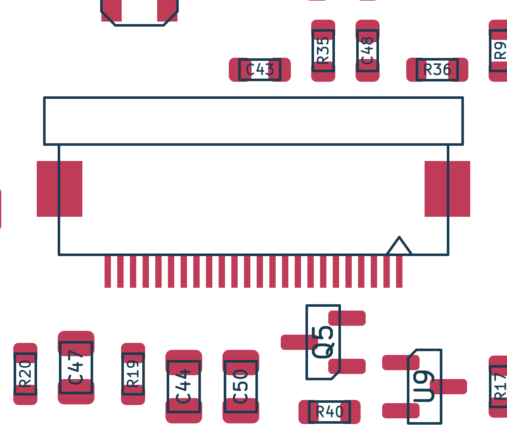

# Top-contact OLED socket update

2026-09-21 · KiCad 10.0.6 · compared with saved design `96c8114`

DS1 now uses **Hirose FH12A-24S-0.5SH(55), JLCPCB C506794**. Its top contacts
match the user's mounted ribbon orientation: the exposed contacts face away
from the PCB. The reported panel has ribbon marking **NFP1309-02Y**, 24 contacts,
0.50 mm pitch and 0.30 mm insertion thickness. The supplied CON24 schematic
remains the electrical reference; all 24 signal assignments are unchanged.

The schematic, project symbol, placed PCB, project-local footprint, engineering
BOM, JLCPCB BOM and purchasing report are updated together. **The display and
external keyboard/keypad remain excluded from the assembly BOM and future CPL.**
DS1 purchases only the socket. J3/J4/J5 remain DNP/user-fitted; onboard interface
electronics remain populated as specified.

## Footprint and placement

The [manufacturer drawing](../../parts%20documentation/FH12A-24S-0.5SH-drawing.pdf),
EDC3-150555-51 sheet 1, was visually checked against the footprint:

| Feature | Implemented geometry |
|---|---|
| Signal lands | 24 × 0.30 × 1.30 mm; 0.50 mm pitch; 11.50 mm pin-center span |
| Mounting lands | Two × 1.80 × 2.20 mm; 17.10 mm outer / 13.50 mm inner span |
| Signal paste | 24 separate 0.25 × 1.30 mm apertures, as drawn by Hirose |
| Pin numbering | Pin 1 left in the drawing's top view with cable entry below; pin 1 is on board right at the retained 180° rotation |
| Housing / latch | Updated outline for 15.35 mm housing, 16.50 mm latch envelope and 6.20 mm housing depth |
| Placement | **(80.00, 108.85 mm), 180°, F.Cu, locked** |

The copper land pattern matches the former bottom-contact footprint, but the
larger latch initially overlapped neighboring courtyards. DS1 moved **0.20 mm
toward the keyboard**, from Y = 108.65 to 108.85 mm, to clear them. Its 47 affected
local trace segments and eight vias were adjusted without adding or deleting
routing items. The board still has 1,066 segments and 321 vias. The other 129
footprints, board outline, graphics, black-mask setting, NFC geometry, USB pair
and breakaway connections remain unchanged.

The local footprint uses an independently authored, simplified VRML envelope
for visual inspection. This is a closed-latch illustration from drawing
dimensions, not manufacturer CAD or a model of the display. Allow approximately
3.6 mm open-latch height and check insertion access in the final enclosure.
`tools/generate_fh12a_footprint.py` reproduces the footprint and envelope.

[Copper, outline and courtyards](top-contact-layout.svg) ·
[Paste apertures and package outline](top-contact-paste.svg)

## Verification

- **Native ERC: 0 violations**, 128 physical components, 91 nets.
- **Native PCB DRC: 0 errors, 0 unconnected items, 0 schematic parity findings**,
  with zone refill and all-track checking. The same two existing U3/ESP32
  silkscreen-edge warnings remain, on the same item UUIDs as the baseline.
- **23/23 layout checks pass**, including pad nets, constrained placements,
  all-layer antenna exclusions, mirrored RF routing, USB reference coverage and
  the five breakaway crossings.
- **32/32 top-contact checks pass**, including drawing-derived lands/paste,
  placed/library agreement, unchanged net membership, unrelated footprints and
  settings, scoped routing changes and assembly exclusions.
- **31/31 OLED regression checks pass**, retaining the independently recorded
  CON24 map and the earlier 26-to-24-contact correction.
- The component-choice and ten-board assembly audits pass. There are still
  **55 purchased part groups and 116 placements per board**.
- **261 ngspice cases completed without solver errors** and numerical results
  are unchanged. The previously documented 600 pF I²C stress case still fails
  rise time; the intended 400 pF design ceiling passes. No full-display or
  physical-board simulation is claimed.
- Native 2D/paste plots and a KiCad 3D rendering were visually reviewed. The
  schematic and seven-page PCB review PDFs are refreshed. The open PCB editor
  was reloaded only after verifying that it held no intervening edits.

[Top-contact checks](top-contact-check.json) · [OLED regression](regression-check.json) ·
[Layout checks](../pcb/layout-check.json) · [DRC](../pcb/drc.json) ·
[Schematic PDF](../schematic.pdf) · [PCB layers](../pcb/layers.pdf)

## Sourcing and remaining physical checks

The downloaded [JLCPCB C506794 record](https://jlcpcb.com/partdetail/HRS_Hirose-FH12A_24S_0_5SH_55/C506794)
listed **5,464 in stock / 5,189 available to order**, with zero public placement
minimum and zero loss allowance, against ten required. This is a dated
observation, not a reservation; other parts retain their prior stock dates.
L2/L3 and C36/C37 remain the existing procurement risks.

CAD checks establish the socket geometry and electrical connections, not the
actual panel's complete pin-1 correspondence, insertion length, fold strain,
enclosure fit, current or optical operation. Check those on the physical panel.
Other display variants need their own compatibility check. The remaining JLCPCB
stackup, fabrication and CPL steps are in the [manufacturing plan](../manufacturing-plan.md).
