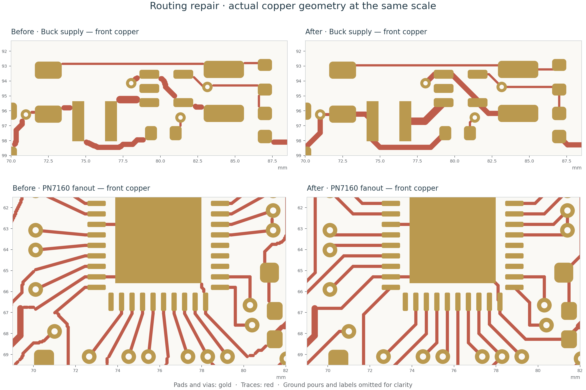

# Full-board routing repair

22 September 2026 · `routing-review-2026-09-22`

The first standard-fabrication revision introduced free-form fragments and
marginal copper joins. Passing connectivity DRC was insufficient: some routes
connected through small copper overlaps without meeting at their centrelines
or entering their pads properly. This revision repairs that regression across
all four copper layers and adds an independent check for those patterns.

[Full-resolution comparison](pcb/routing-comparison.svg) ·
[Current top view](pcb/top.svg) · [All copper layers](pcb/copper-layers.svg) ·
[Manufacturing package](../manufacturing/routing-review-2026-09-22-package.zip)

| Geometry audit | Before repair | Current board |
|---|---:|---:|
| Trace segments | 1,931 | 1,021 |
| Routing vias | 316 | 312 |
| Non-45-degree segments | 141 | 0 |
| Shallow or unsupported trace endpoints | 286 | 0 |
| Connected groups relying on copper-edge overlap | 38 | 0 |
| Duplicate segments | 3 | 0 |
| Acute two-segment return bends | 3 | 0 |
| Exposed segments shorter than 0.20 mm | 793 | 0 |

Counts come from the same checker on the saved
[before](pcb/routing-before.json) and [after](pcb/routing-quality.json) geometry.
They identify routing patterns, not predicted manufacturing failures; findings
can overlap. Fewer segments alone is not a quality criterion.

Routes now follow horizontal, vertical and 45-degree lines, with continuous
centreline joins and substantial entries into pad/via lands. Redundant tails,
tiny staircases, duplicate copper and sharp return bends have been removed.
Power connections were rebuilt at appropriate existing widths, with several
formerly narrow connections widened. The NFC matching buses remain exactly
mirrored. Explicit ground and supply connections were restored wherever the
old layout depended on marginal copper overlap.

Five unused vias were removed and one ground via was added for C43's local
ground island. An existing 3V3 via near the NFC address routes moved 0.15 mm
left to permit a clean diagonal without a tiny jog. All remaining routing vias
retain the ordinary 0.30 mm drill / 0.70 mm land construction.

All 130 footprint positions and rotations, pad geometry and nets, component
values and 3D-model references are unchanged from the start of this repair.
Connectors, the ESP32 module, antenna copper, outline, rear artwork and keyboard
bridge remain in place. The earlier nineteen placement changes are documented
in the [standard-fabrication report](standard-fabrication.md); this repair
required no further component moves. The **17.70 × 5.00 mm ribbon-access area**
above DS1 remains enforced and empty of component courtyards. C43's reference
was moved from silkscreen to the fabrication drawing to clear its new ground via.

## Validation

- Native KiCad DRC, with refilled zones, all-track checks and schematic parity:
  **0 errors, 0 unconnected items, 0 parity findings, no dangling copper**.
- Schematic ERC and independent pin/net verification: **0 violations**.
- **21 layout checks, 16 fabrication checks and all six routing-quality checks
  pass.** The checks cover fixed geometry, mirrored matching copper, pours,
  open-via separation, connector lands and the ribbon keepout.
- **Five routing-audit regression tests pass**, including barely touching trace
  ends, grazing pad entries, sharp return bends and acceptable buried segments.
- Component selection and five-board assembly audits pass; the BOM still has
  **116 populated components per board and 55 distinct purchased parts**.
- **261 scoped ngspice cases complete without solver errors**, using the current
  saved board and verified schematic. Model findings and limits are unchanged.

The routing audit operates on native pad polygons and actual track/via widths,
using a 0.002 mm coordinate tolerance. It tests both physical copper contact and
a stricter network requiring centreline joins or deep land entries. For a
land wide enough to accept the track, the endpoint must lie at least half a
trace width inside it, within tolerance. The short-segment check excludes
segments buried inside pads or vias; a segment under 0.20 mm with more than
0.01 mm of exposed centreline is rejected. True T/Y branches are distinguished
from acute two-segment return bends. Filled-zone connectivity and clearance
remain native DRC responsibilities.

Enlarged geometry views were inspected around the PN7160 fanout, matching
network, buck supply, OLED, USB, ESP32 and keyboard, alongside the four-layer
native plots. Review drawings hide catalogue fields that otherwise obscure
the copper. The source footprint fields are preserved.

Forty **cosmetic DRC warnings** remain: 37 footprint/library differences from
front-legend edits, two existing ESP32 legend/edge warnings and one rear-artwork
overlap clipped against mask during Gerber export. The footprint core-geometry
audit passes independently of these legend differences.

Two **USB advisories remain unmet**: U4-to-R12/R13 D−/D+ routes measure
41.3053 / 42.2968 mm, a 0.9915 mm mismatch against the 0.5 mm advisory, and two
of 2,171 sampled trace-edge points lack In2 ground beneath them. They are near
(63.6764, 110.6703) and (63.5703, 110.7764) mm. The length mismatch increased
from 0.1406 mm in the previous revision. These findings are explicit in
[layout-check.json](pcb/layout-check.json); impedance tuning was outside the
requested manufacturing-focused scope. USB performance is not qualified by
this repair or by the passive SPICE models.

The simulations cover NFC passive-network assumptions, I²C rise times, RC
timing and ideal converter DC setpoints. The existing 400 pF I²C ceiling and
200 ms ADC-settling guidance remain. They do not extract board parasitics or
simulate full IC behavior, converter switching, RF radiation, USB or thermals.
[Simulation report](simulation/README.md). These geometric and electrical
checks do not establish defect-free fabrication or replace prototype bring-up.

## Files and reproduction

The root KiCad board is the editable source. The new
[five-board manufacturing package](../manufacturing/routing-review-2026-09-22-package.zip)
contains regenerated Gerbers, drill data, stencil, placements, assembly/layer
drawings and validation reports. It supersedes `standard-2026-09-22`. The
previously submitted JLCPCB r2 archive remains unchanged.

Run the full sequence in [PCB layout](pcb-layout.md#reproduce). The added tools
are `export_routing_geometry.py` (KiCad's `pcbnew` Python) and
`check_routing_quality.py` (Python with Shapely 2). The latter rejects stale
geometry by checking the source board's SHA-256 hash. Run
`python3 tools/test_routing_quality.py` in the Shapely environment to repeat
the regression tests. Export similarly rejects stale routing, fabrication,
schematic or simulation inputs. Do not reuse an earlier Gerber ZIP after
changing the board.
