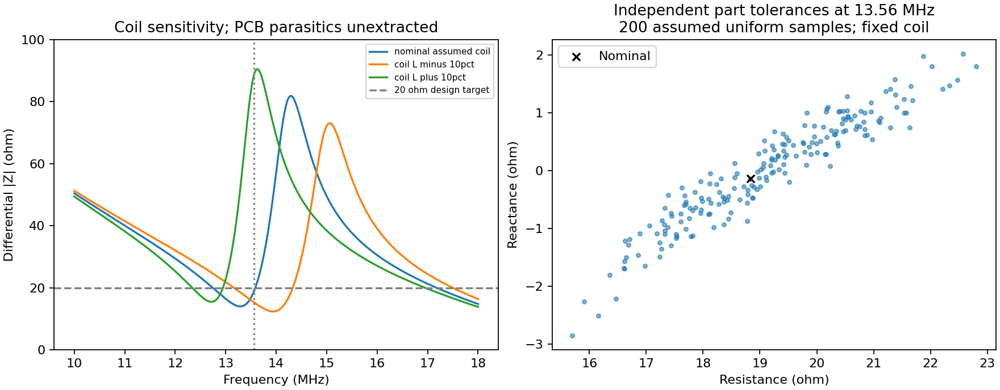
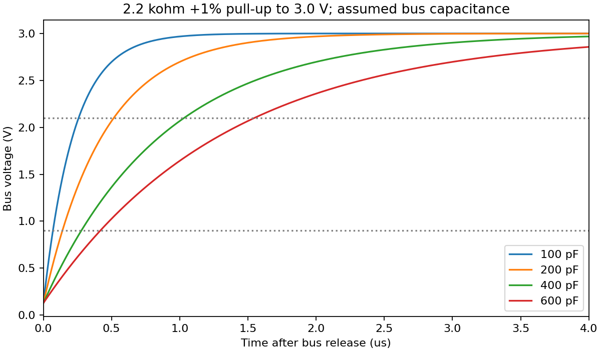

# Circuit simulation screening

2026-09-21 · base commit `600d88a` plus the 24-pin OLED working-tree update · KiCad's bundled ngspice 45.2

The 261 cases were rerun after the connector correction. Results record the
actual working-tree file hashes; the electrical findings below are unchanged.

**261 scoped simulation cases completed. This is a partial electrical analysis,
not a complete simulation of the assembled PCB or a fabrication release.**
It highlights antenna-tuning sensitivity, cable-capacitance limits and a battery
measurement settling-time improvement. It does not establish a new definite
PCB wiring defect in the portions modeled.

[Machine-readable results](results.json) · [Solver log](ngspice.log) ·
[Simulation script](../../tools/simulate_preflight.py) · [SPICE node names](node-map.json)

Before simulation, the script checks all 128 schematic components against the
saved PCB for values, pad nets and population flags. The five schematic hashes
must match the independently verified exported netlist. Results record the
design, netlist, assumptions and script hashes. The production KiCad files are
unchanged.

## Findings and actions

| Area | Result | Consequence |
|---|---|---|
| NFC nominal passive match | **18.838 − j0.140 Ω** at 13.56 MHz, versus the 20 Ω differential target | Consistent with the earlier bare-coil calculation, under the same assumed coil model. This does not validate the populated inside-feed antenna. |
| NFC coil inductance sensitivity | −10% L gives **6.82 − j13.67 Ω**; +10% gives **80.03 − j38.06 Ω**, with other parameters held fixed | The actual coil and nearby conductors must be characterized and the matching capacitors retuned. These are assumed scenarios, not predicted manufacturing tolerances. |
| NFC stray capacitance | Adding an assumed 1 pF from each matching node to ground changes the result to **20.63 + j0.79 Ω**; 3 pF gives **25.00 + j2.51 Ω** | DNP pads, routes and component mounting can matter. Their actual parasitics have not been extracted. |
| NFC component tolerance | 200 independent, uniformly sampled tolerance cases with a fixed assumed coil produced Re(Z) **15.70–22.80 Ω**, Im(Z) **−2.85–+2.02 Ω** | Part tolerance adds spread even before coil/enclosure uncertainty. This is not a worst-case bound or production-yield estimate. |
| I²C, 400 pF assumed total load | **753 ns** 30–70% rise time with the 2.2 kΩ pull-up at +1% | Passes the 1 µs Standard-mode rise limit. Use 100 kHz; PCF8574T is a 100 kHz device. |
| I²C, 600 pF cable/load scenario | **1.130 µs**, exceeding the rise limit and the design's 400 pF capacitance ceiling | Keep the detached keyboard cable/load within the capacitance budget; a larger extension needs a separate interface design. Actual capacitance is unmeasured. |
| Battery ADC divider startup | At +1% R and +10% C, 120 ms leaves **1.009%** settling error. Reaching 0.1% takes **180.35 ms**; 200 ms leaves **0.047%** | Use at least 200 ms as the initial firmware settling allowance if targeting <0.1% RC settling error under these assumptions. This excludes ADC acquisition, leakage, capacitor temperature effects and divider/calibration error. |
| OLED reset release | R35/C48 reaches 80% of the 3 V rail in **1.79 ms** at +R/+C tolerance | The documented 5 ms wait has margin in this passive RC case. It does not prove complete display sequencing. |
| ESP enable release | R8/C12 reaches 75% of its rail in **15.40 ms**, after ideal reset release | This delay is additional to the supervisor's delay; its output sink, propagation and glitch behavior were not simulated. |
| Buck DC setpoint | **3.228–3.393 V** over 16 reference/bias/resistor cases | Static setpoint remains in the documented range. Minimum regulation is only **39.2 mV above the maximum supervisor release threshold**, or **86.4 mV above its maximum falling threshold**. Dynamic droop and ripple still need validation. |
| OLED boost DC setpoint | **11.499–13.504 V** over 16 reference/bias/resistor cases | Static target lies within the panel's 7–16 V operating range. This does not establish startup overshoot, current capability or loop stability. |

The ADC settling result refines the earlier 120 ms guideline. Most of the other
findings quantify risks already called out in the design documentation. No
component values, routing or footprints were changed based on these assumed
models.

## Models actually exercised

The NFC generator selects the current R41/R42, L2/L3, C28–C39, C53/C54 and
R25–R28 connections from the netlist and excludes DNP parts. It uses:

- Coilcraft's archived 0805HP-151 equivalent circuit, with its frequency-dependent
  loss evaluated at 13.56 MHz. The plotted 10–18 MHz sweeps hold this loss fixed
  and are approximate away from the carrier.
- 0.03 Ω capacitor ESR per populated RF capacitor, an assumption.
- Ideal balanced voltage sources at U6.21/TX1 and U6.19/TX2, and assumed 2.2 kΩ
  receiver loads at U6.15/RXN and U6.16/RXP. Separate 1 kΩ and 10 kΩ receiver-load
  scenarios are included; neither replaces an active AGC model.
- The existing assumed antenna equivalent: **1.559 µH, 1.5 Ω, 2 pF**. The new
  inside feed, four-layer mounting, in-loop circuitry, tag and enclosure are
  not physically represented by this equivalent.
- 1 µΩ numerical shorts for the zero-ohm TX links. Their real mounting and
  interconnect impedance is unknown.

The nominal RF result agrees with the independent earlier half-circuit result
to better than one part per million. The small difference includes the modeled
numerical TX-link resistances. This tests extraction and numerical conventions,
not physical model accuracy.

The ideal 3.3 V differential square-wave **fundamental alone** implies about
47.2 V peak across the modeled coil. This is a stress estimate, not a measured
peak or a guarantee for the 100 V capacitors; driver impedance, harmonics and
external fields are excluded. Coil conductor current in the new output refers
to current through the series RL branch, excluding its parallel capacitance.

The I²C simulation uses an ideal 3 V supply, the actual pull-ups, an assumed
capacitive bus and a switch representing an open-drain sink. R38/R39 remain DNP.
Reset and ADC simulations use only the actual passive networks and idealized
excitation. The buck/boost DC runs enforce ideal feedback regulation; they
are **not switching-converter simulations**. Analytical RC and DC expressions
independently check the numerical measurements.





## What still needs a different model or hardware

| Analysis | Required inputs or tool |
|---|---|
| Actual NFC antenna tuning and coupling | An EM model of the full copper/component/enclosure geometry, or a measured complex antenna impedance fitted to an RL/C model. openEMS is one possible field solver. Final populated-board tuning remains necessary. |
| SY8089 and AP3012 startup/load steps/stability | Validated models for the exact controllers, inductors, biased capacitances, loads and source impedance. The project currently has no validated switching models for these ICs. |
| Reset during fast supply dips | Exact TLV803EA30 output/timing model and buck transient waveform. TI publishes a TLV803EA29DBZ model; its 2.93 V variant cannot be silently substituted for this board's 3.08 V part. |
| USB handover/inrush and charging | Source/cable impedance, D1/D2/Q1 and charger models, battery behavior and actual loads. The existing low-VBUS charging-headroom and uncontrolled-inrush concerns remain open. |
| USB signal quality and power distribution | Extracted trace/via/plane parasitics, stackup material data and appropriate driver/receiver models. Dedicated SI/PI tools such as SIwave address this class of problem. |
| Read range, firmware, oscillator, display and temperatures | Device-specific behavioral/oscillator/thermal models and ultimately prototype measurements. Generic ideal IC substitutes would not establish those behaviors. |

The existing [layout/DRC report](../pcb-layout.md) complements these simulations.
It checks physical connectivity and clearances; it does not prove the above
electrical behaviors.

## Reproduce

Run from the repository with Python, numpy, matplotlib and a shared ngspice
library. The existing [NFC requirements](../../tools/nfc/requirements.txt) contain
the tested numerical packages. On this machine:

```sh
MPLCONFIGDIR=/private/tmp/nucula-simulation-matplotlib \
  /private/tmp/nucula-nfc-venv/bin/python tools/simulate_preflight.py
```

Elsewhere, run `python3 tools/simulate_preflight.py`; set `NGSPICE_LIBRARY` to
the shared library path if different from KiCad's macOS installation. `--out`
selects another output directory. The saved `.cir` files can also be loaded into
standalone ngspice. `node-map.json` maps their nodes to schematic net names.

The complete run contains 15 NFC parameter cases, 200 part-tolerance cases,
three NFC frequency sweeps, eight I²C cases, three passive RC transients and
32 ideal DC-regulation cases. All completed without solver errors. The bundled
library reports a missing optional `spinit` initialization file; no XSPICE
models or initialization commands are used here, and the independent analytical
cross-checks pass.

## References

- [KiCad simulator and model requirements](https://docs.kicad.org/10.0/en/eeschema/eeschema.html#simulator)
- [Analog Devices LTspice models and demonstration circuits](https://www.analog.com/en/resources/design-tools-and-calculators/ltspice-simulator/lt-spice-demo-circuits.html)
- [openEMS electromagnetic field solver](https://www.openems.de/)
- [Ansys SIwave signal/power integrity and EMI analysis](https://ansys.synopsys.com/products/electronics/ansys-siwave)
- [NXP I²C specification, Table 10](https://www.nxp.com/docs/en/user-guide/UM10204.pdf)
- [NXP PCF8574/PCF8574A datasheet](https://www.nxp.com/docs/en/data-sheet/PCF8574_PCF8574A.pdf)
- [TI TLV803E datasheet and simulation models](https://www.ti.com/product/TLV803E)
- [Existing NFC assumptions and manufacturer-model provenance](../nfc-antenna.md#complete-differential-matching-network)
- [Existing converter, panel and supply assumptions](../peripherals-design.md)
