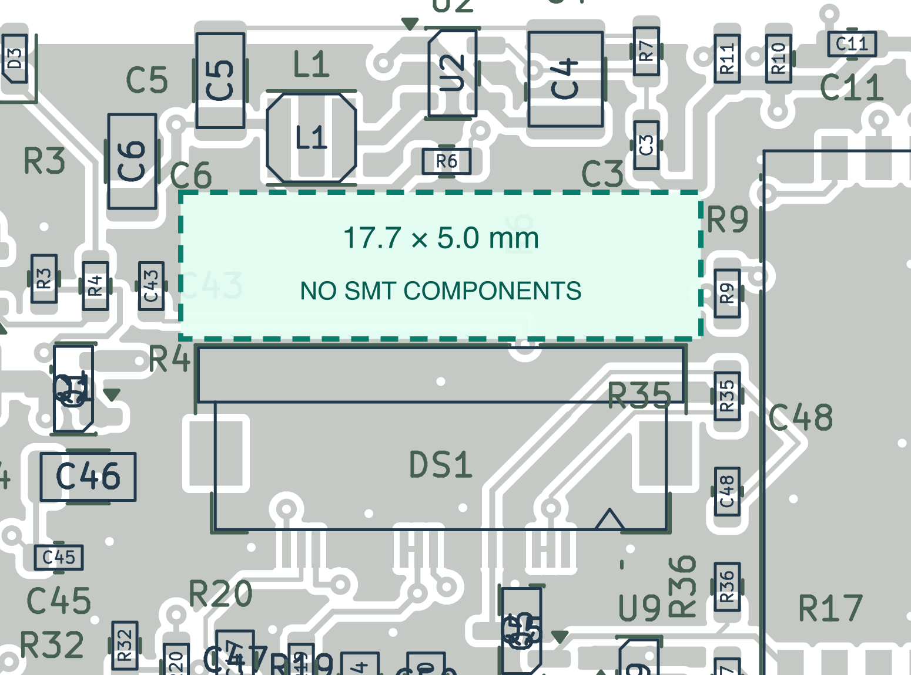

# Standard-fabrication revision and OLED ribbon access

The current release is **routing-review-2026-09-22**. It retains the fabrication
and placement changes below and repairs the routing regression introduced with
them. [Routing review, before/after comparison and current validation](routing-review.md).

This revision is for five bare boards and manual top-side reflow assembly. It
replaces the filled/capped-via fabrication specification for new contingency
orders. The JLCPCB r2 order already submitted uses its archived files.

The OLED connector DS1 remains at (80.00, 108.85) mm, rotated 180°. A **17.70 ×
5.00 mm component keepout** sits immediately above its open-latch courtyard,
toward the antenna: x = 71.15–88.85 mm, y = 98.55–103.55 mm. KiCad forbids front
footprints there. An independent check also tests component courtyards against
the rectangle. Copper, tracks and vias are permitted. This is installation
clearance, not a measured flex bend-radius or enclosure fit guarantee.

Nineteen components move. C3/C4/C6, L1, U2 and R6/R7 move above the access area;
C43 moves to its left; R35/C48/R36 move to the connector's right. U6 and C21/C23
move farther toward the top of the antenna aperture to give the larger vias
space to escape. R21/R23/R24 shift left, and C15/C17 move to make room for
ordinary via lands and soldermask separation. Exact before/after positions are in `pcb/standard-changes.json`.
Values, manufacturer part numbers and the 116 populated placements per board
are unchanged. Connector positions, the antenna copper, matching-tree symmetry,
board outline and five functional breakaway crossings remain constrained.

[Complete five-board package](../manufacturing/routing-review-2026-09-22-package.zip) ·
[Order settings](manufacturing-release.md) · [Current board view](pcb/top.svg)

## Fabrication changes

| Feature | Current specification |
|---|---|
| Board | Four layers, nominal 1.6 mm FR-4; supplier standard stackup and tolerances |
| Copper | 1 oz outer, supplier standard inner copper |
| Mask / legend / finish | Green / white / ENIG |
| Routing vias | 0.30 mm finished holes, 0.70 mm lands; ordinary open through-vias |
| Via treatment | No filling, capping, plugging or custom via-in-pad process |
| Tracks / net clearance | At least 0.15 mm / 0.20 mm |
| NPTH-to-copper clearance | At least 0.25 mm |
| USB shell slots | 0.70 mm width, at least 0.30 mm annular ring |
| Impedance | No controlled-impedance order or custom dielectric requirement |
| Assembly | All parts on top; 100 µm top stencil, DNP paste omitted |

The ESP32 module's optional centre solder joint is omitted. Its pad 19 remains
GND copper under soldermask, with no paste or twelve-hole thermal array. Required
GND pin 9 remains soldered. Espressif permits omission of the centre solder
joint; the altered thermal path still requires prototype temperature checks.
See the [ESP32-C3-WROOM-02 datasheet, land pattern notes](https://www.espressif.com/sites/default/files/documentation/esp32-c3-wroom-02_datasheet_en.pdf#page=34).
The PN7160 exposed pad remains soldered, without vias in its wettable pad.

J1 still uses GCT USB4105-GF-A-120. Its custom `_Standard` footprint retains the
slot centres and peg holes from the GCT drawing. The four plated slots widen
from 0.60 to 0.70 mm and their copper lands widen to 1.30 mm. The four outer GND
lands become 0.60 × 1.05 mm at local y = −3.73 mm, preserving their outer toe
edge and shortening the hole-facing heel another 0.06 mm from r2. This provides
ordinary 0.25 mm NPTH clearance. It is a project land-pattern adaptation; the
physical connector fit and solder joint have not been bench-tested.

These dimensions are intended to fit common prototype processes. Representative
published limits are [Eurocircuits PCBProto](https://www.eurocircuits.com/services/pcb-proto/)
and [AISLER four-layer ENIG rules](https://community.aisler.net/t/4-layer-35-m-enig-design-rules/3733),
checked 22 September 2026. Supplier CAM acceptance, available service options
and delivery times are not established by a local DRC pass. The retained
functional keyboard breakaway is still an outline feature a supplier may review.

## Verification and model limits

Final checks on 22 September 2026:

- Schematic ERC: **0 violations**; 128 physical components and 91 nets verified.
- Native PCB DRC: **0 errors, 0 unconnected items, 0 schematic-parity findings**;
  no dangling copper or component courtyard collisions.
- **21 layout checks and 16 standard-fabrication checks pass**, including the
  empty ribbon area, unchanged coil/outline, net membership and open-via clearance.
- **Six routing-quality checks pass** after the subsequent routing repair;
  pad/via entries are substantial and trace joins meet at their centrelines.
- **261 scoped ngspice cases complete with no solver errors**. The existing
  400 pF I²C load ceiling and 200 ms ADC settling recommendation remain.
- Component/footprint and five-board assembly audits pass: 116 populated parts
  per board, 55 distinct BOM lines. Stock observations are dated, not reservations.

The native report retains **40 cosmetic warnings**: 37 footprint-library
mismatches solely from clipping front legend around the open vias, two existing
ESP32 legend/edge warnings at its overhang, and one preserved back-artwork/mask
overlap. Export subtracts soldermask from legend. The
[silk audit](pcb/standard-silk-audit.json) independently hashes every footprint's
non-legend geometry to verify that the clipping changed no pads, courtyards,
models or embedded rules.

[Native DRC](pcb/drc.json) · [Layout checks](pcb/layout-check.json) ·
[Fabrication checks](pcb/standard-fabrication-check.json) ·
[Schematic verification](verification.json) · [Simulation results](simulation/results.json)

Native KiCad DRC refills the copper zones and checks all track errors and
schematic parity. `check_pcb_layout.py` separately checks placements, logical
nets, values, antenna/outline preservation, RF symmetry, pour exclusions and
breakaway geometry. `check_standard_fabrication.py` checks the cable keepout,
via/pad separation, USB slots, ESP32 land change and fabrication settings.

The USB trace-length and reference-plane observations are still reported but
are advisory for this revision, following the requested scope. Supplier stackup
changes are not compensated by an impedance optimization.

The electrical preflight reruns 261 scoped ngspice cases using the saved design's
values and verified connectivity: NFC passive-network sensitivity, I²C rise
times, RC timing and converter DC setpoints. The report records source hashes.
These models do not extract the new PCB's parasitics or simulate complete ICs,
USB signal integrity, RF radiation, switching startup, thermals or firmware.
See [simulation findings and assumptions](simulation/README.md).

Historical `check_top_contact_update.py` and `check_usb_clearance.py` test isolated
changes against earlier locked boards. They are historical regression records;
the current checks above cover this broader authorized revision.
