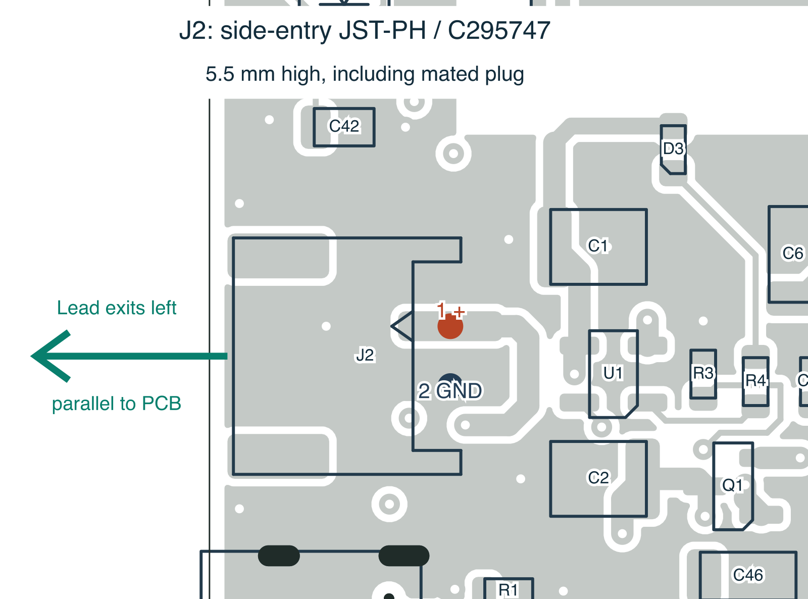

# J2 side-entry battery connector — 7 October 2026

Fit **JST S2B-PH-SM4-TB(LF)(SN), JLCPCB C295747**. This horizontal SMT
header preserves the existing **PHR-2, 2.00 mm pitch** battery plug and the
electrical assignment **pin 1 = battery positive, pin 2 = GND**. The opening
faces the left PCB edge and the lead leaves parallel to the PCB.

## Selection and availability

The [JST PH drawing](https://www.jst-mfg.com/product/pdf/eng/ePH.pdf), pages 2
and 4, specifies the side-entry SMT package and land pattern. It is **5.5 mm
high, including the mated connector**, compared with 8.6 mm for the upright
SMT assembly (the upright header alone is 6.6 mm). The side-entry through-hole
PH assembly is 6.25 mm high. This selects the lower of JST's documented
side-entry PH mounting options while keeping the user's existing plug.
Smaller connector families would require a different battery lead and were
excluded because the user requested PH compatibility.

The housing is 7.9 mm wide. JST specifies 2 A with AWG 24 wire; the project's
100 mA charge current is unchanged. Connector rating does not establish the
cell's discharge capability. Confirm actual battery-lead polarity before use;
the housing family does not standardize third-party red/black wire assignment.

[JLCPCB C295747](https://jlcpcb.com/partdetail/JST-S2B_PH_SM4_TB_LF_SN/C295747)
is an extended-library SMT part available for Economic and Standard assembly.
The public catalogue API observation on **2026-10-07** reported **16,365 in
stock and 15,581 available to order**, with unit price **USD 0.2364** at 1–49
pieces, before assembly charges. This is a dated observation, not a reservation.
The current stock snapshot retains the exact manufacturer, MPN, package,
query, retrieval timestamp and response hash; signed media URLs are excluded.
Only J2 stock was refreshed for this change; other BOM stock observations keep
their own retrieval dates.

## Rev A finding and implementation

The Rev A schematic, footprint and archived JLCPCB BOM explicitly specified
the **vertical B2B-PH-SM4-TB(LF)(SN), C160352**. The received upright connector
is consistent with those files. These records do not show a manufacturer
substitution; an earlier side-entry intent was not carried into that release.

The new project-local footprint derives from KiCad 10.0.6's
`JST_PH_S2B-PH-SM4-TB_1x02-1MP_P2.00mm_Horizontal`. Manufacturer dimensions and
pad numbering were checked against the top-view JST land drawing:

| Land | Local centre, mm | Size, mm | Connection |
| --- | --- | --- | --- |
| 1 | −1.00, −2.85 | 1.00 × 3.50 | VBAT positive |
| 2 | +1.00, −2.85 | 1.00 × 3.50 | GND |
| MP | −3.35, +2.90 | 1.50 × 3.40 | Unconnected hold-down |
| MP | +3.35, +2.90 | 1.50 × 3.40 | Unconnected hold-down |

All four pads include soldermask and paste openings. There are no drilled pads.
The missing optional KiCad STEP reference is omitted; no substitute 3D model
is claimed. The footprint library retains the KiCad license with design exception.
The board instance trims only adjacent silkscreen to clear an existing via and
the C2 reference; lands, body outline and courtyard match the library.

J2 is locked at **(55.20, 100.90) mm, −90°** in KiCad. The mating face is at
X = 50.80 mm, 0.80 mm inside the left edge. The entire courtyard remains on
the board and the mounting copper has 0.60 mm edge clearance. A component
approach audit checks the gap to the board edge. The enclosure must leave room
outside that edge for the plug, lead bend and insertion/removal.

VBAT/GND are rerouted locally with 45° transitions and full land entries;
two ground vias and one VBAT via move to clear the new footprint. All other
component footprints, the board outline, display and antenna geometry are
preserved. This is **not a drop-in part change on an already fabricated Rev A**.

## Assembly and validation

**Do not substitute B2B-PH-SM4-TB or any other top-entry header.** Confirm the
opening faces the left edge, parallel to the PCB, in the supplier assembly
preview. In the CPL coordinate system, origin (50,160) with Y upward:

| Feature | X, mm | Y, mm | Rotation |
| --- | --- | --- | --- |
| J2 footprint anchor | 5.200 | 59.100 | 270° |
| Pin 1, VBAT positive | 8.050 | 60.100 | — |
| Pin 2, GND | 8.050 | 58.100 | — |

The CPL preserves the KiCad anchor with no assumed catalogue-centre offsets.
Supplier preview alignment remains necessary; the pad coordinate file allows
an explicit pin check. BOM, CPL, paste, Gerbers, drill files, schematic and
assembly drawings are regenerated together in the new October package.
September manufacturing archives remain records of their original designs.

The [connector check](../validation/battery-connector-check.json) verifies exact
part selection, land dimensions, polarity, rotation, body/courtyard, SMT paste
and clear plug approach. Native ERC is clean; PCB DRC has zero errors,
zero unconnected items and zero schematic-parity findings. All six routing
geometry checks pass. The existing 45 cosmetic DRC warnings remain reviewed.
The package also contains the earlier October USB/display revisions; their
revised-hardware bench validation remains outstanding.
